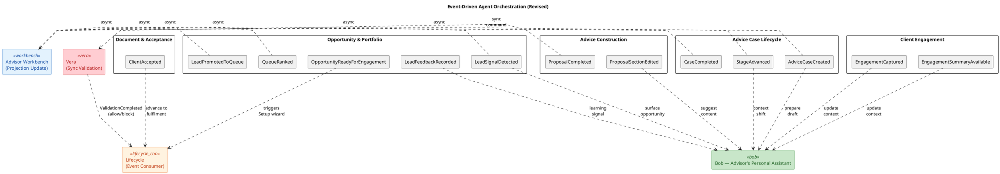

```plantuml
@startuml AIR_Event_Flow

skinparam linetype polyline

title Event-Driven Agent Orchestration (Revised)

skinparam rectangle {
    BackgroundColor<<bob>> #C8E6C9
    BorderColor<<bob>> #388E3C
    FontColor<<bob>> #1B5E20
    BackgroundColor<<vera>> #FFCDD2
    BorderColor<<vera>> #D32F2F
    FontColor<<vera>> #B71C1C
    BackgroundColor<<workbench>> #E3F2FD
    BorderColor<<workbench>> #1565C0
    FontColor<<workbench>> #0D47A1
    BackgroundColor<<lifecycle_con>> #FFF3E0
    BorderColor<<lifecycle_con>> #E65100
    FontColor<<lifecycle_con>> #BF360C
}


' === Row 1: Upper domain event sources ===
together {
    rectangle "Advice Case Lifecycle" as lifecycle_pub {
        rectangle "AdviceCaseCreated" as acc
        rectangle "StageAdvanced" as sa
        rectangle "CaseCompleted" as cc
    }

    rectangle "Advice Construction" as construction {
        rectangle "ProposalSectionEdited" as pse
        rectangle "ProposalCompleted" as pc
    }

    rectangle "Client Engagement" as engagement {
        rectangle "EngagementCaptured" as ec
        rectangle "EngagementSummaryAvailable" as esa
    }
}

' === Row 2: Lower domain event sources ===
together {
    rectangle "Opportunity & Portfolio" as opportunity {
        rectangle "LeadSignalDetected" as lsd
        rectangle "LeadPromotedToQueue" as lpq
        rectangle "LeadFeedbackRecorded" as lfr
        rectangle "OpportunityReadyForEngagement" as ore
        rectangle "QueueRanked" as qr
    }

    rectangle "Document & Acceptance" as document {
        rectangle "ClientAccepted" as ca
    }
}

' === Left side: Advisor Workbench ===
rectangle "Advisor Workbench\n(Projection Update)" <<workbench>> as workbench {
}

' === Right side: Vera + Lifecycle Consumer ===
rectangle "Vera\n(Sync Validation)" <<vera>> as vera {
}

rectangle "Lifecycle\n(Event Consumer)" <<lifecycle_con>> as lifecycle_con {
}

' === Bottom: Bob ===
rectangle "Bob — Advisor's Personal Assistant" <<bob>> as bob {
}

' === Relationships: Events -> Workbench (left) ===
lsd ..left..> workbench : async
lpq ..left..> workbench : async
qr ..left..> workbench : async
acc ..left..> workbench : async
sa ..left..> workbench : async
cc ..left..> workbench : async

' === Relationships: Events -> Vera (right) ===
pc ..right..> vera : sync\ncommand

' === Relationships: Vera -> Lifecycle Consumer ===
vera ..down..> lifecycle_con : ValidationCompleted\n(allow/block)

' === Relationships: Events -> Lifecycle Consumer (right) ===
ore ..right..> lifecycle_con : triggers\nSetup wizard
ca ..right..> lifecycle_con : advance to\nfulfilment

' === Relationships: Events -> Bob (bottom) ===
lsd ..down..> bob : surface\nopportunity
lfr ..down..> bob : learning\nsignal
acc ..down..> bob : prepare\ndraft
sa ..down..> bob : context\nshift
pse ..down..> bob : suggest\ncontent
ec ..down..> bob : update\ncontext
esa ..down..> bob : update\ncontext

@enduml
```