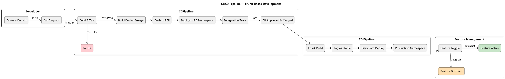

# AIR (Advice & Intelligence Relationship) System Architecture Design

## Level 1: System Context Diagram

Shows the AIR system in its environment, with external actors and systems.

![[Context]]


## Level 2: Container Diagram

Shows the major deployable units and their interactions.

![[Container]]

## Level 3: Component Diagram — AIR API (Modular Monolith)

Shows the internal module structure of the monolith, aligned to the revised bounded contexts.

![[Component - API]]

## Level 3: Component Diagram — AI Agents & Orchestration

Focused view of how Bob and Vera interact with the domain modules. Gary is deferred.

![[Component - AI]]

## Level 4: Deployment Diagram

Shows the physical deployment topology on AWS.

```plantuml
@startuml AIR_Deployment
!include https://raw.githubusercontent.com/plantuml-stdlib/C4-PlantUML/master/C4_Deployment.puml

LAYOUT_WITH_LEGEND()
LAYOUT_LEFT_RIGHT()

title AIR Deployment Diagram — AWS EKS

' === External Services (horizontally aligned) ===
together {
    Deployment_Node(entra, "Microsoft Entra ID", "Identity Provider") {
        Container(entraId, "Entra ID", "OAuth2/OIDC", "Corporate authentication, JWKS endpoint for token validation")
    }

    Deployment_Node(pep_node, "PEP (Policy Enforcement Point)", "Enterprise API Gateway — Same VPC / Peering") {
        Container(pepService, "AdviceConsumer API", "REST Service via PEP", "Lead sync source, deal execution target — accessed through enterprise API gateway")
    }
}

' === Tier 2: Presentation Layer ===
Deployment_Node(aws, "AWS Cloud", "Amazon Web Services") {

    Deployment_Node(cloudfront_node, "CloudFront", "CDN") {
        Container(cdn, "CloudFront Distribution", "AWS CloudFront", "Routes /api/* to ALB, serves static assets from S3")
    }

    Deployment_Node(s3_node, "S3 Bucket", "Static Hosting") {
        Container(angular, "Angular SPA", "Angular 19+ build artefacts", "Advisor workbench, dashboards, proposal builder UI")
    }

    ' === Tier 3: API / Ingress Layer ===
    Deployment_Node(vpc, "VPC (Private)", "AWS VPC") {

        Deployment_Node(eks, "EKS Cluster", "Kubernetes 1.28+") {

            Deployment_Node(alb_node, "ALB", "AWS Application Load Balancer") {
                Container(alb, "Ingress Controller", "AWS ALB Ingress", "TLS termination, path-based routing to pods")
            }

            ' === Tier 4: Service Layer (vertically aligned namespaces) ===
            together {
                Deployment_Node(ns_main, "Namespace: air-production", "Kubernetes Namespace") {
                    Container(pod1, "AIR API Pod (replica 1)", "Java 21, Spring Boot 4.x", "Modular monolith with all bounded context modules + Bob & Vera agents")
                    Container(pod2, "AIR API Pod (replica 2)", "Java 21, Spring Boot 4.x", "Horizontal scaling via HPA")
                }

                Deployment_Node(ns_pr, "Namespace: air-pr-env (x2-3)", "PR Environment") {
                    Container(prPod, "AIR API Pod (PR)", "Java 21, Spring Boot 4.x", "PR environment with mock/staging data loaded via Liquibase profiles")
                }
            }
        }

        ' === Tier 5: Data Layer (rightmost) ===
        Deployment_Node(rds_node, "RDS", "AWS RDS Multi-AZ") {
            ContainerDb(rds, "PostgreSQL 15+", "AWS RDS", "Multi-AZ, encrypted at rest, module-owned schemas")
        }

        Deployment_Node(ecr_node, "ECR", "Container Registry") {
            Container(ecr, "Container Images", "AWS ECR", "Docker images built via CI/CD pipeline")
        }
    }
}

' === Relationships: left-to-right flow ===
Rel(cdn, angular, "Serves static assets", "HTTPS")
Rel(cdn, alb, "Proxies /api/* requests", "HTTPS")
Rel(alb, pod1, "Routes traffic", "HTTP/8080")
Rel(alb, pod2, "Routes traffic", "HTTP/8080")
Rel(pod1, rds, "JDBC connections", "PostgreSQL/5432")
Rel(pod2, rds, "JDBC connections", "PostgreSQL/5432")
Rel(pod1, pepService, "REST calls via PEP with circuit breaker", "HTTPS")
Rel(pod1, entraId, "JWKS validation", "HTTPS")
Rel(prPod, rds, "Uses staging data profile", "PostgreSQL/5432")

@enduml
```

## CI/CD Pipeline Flow

Illustrates the trunk-based development and deployment pipeline.



## Event Flow Diagram

Shows the event-driven orchestration pattern aligned to the revised bounded contexts.

![[Event Flow]]

---

## Diagram Summary

| Level | Diagram | Purpose |
|-------|---------|---------|
| C4 Level 1 | System Context | Shows AIR in its ecosystem with users and external systems |
| C4 Level 2 | Container | Shows deployable units — SPA, API monolith, DB, Bob & Vera agents, event bus |
| C4 Level 3 | Component (API) | Shows internal bounded context modules within the monolith (9 active contexts) |
| C4 Level 3 | Component (Agents) | Shows Bob's cross-context read/write access and Vera's sync validation role |
| C4 Level 4 | Deployment | Shows AWS infrastructure topology — EKS, RDS, CloudFront, S3 |
| Supplementary | CI/CD Pipeline | Shows trunk-based development and daily deployment flow |
| Supplementary | Event Flow | Shows event-driven orchestration with revised event catalogue |

---

## Key Architecture Characteristics

- **Modular Monolith**: All bounded contexts deployed as a single unit for speed, with explicit module boundaries for future decomposition
- **9 Active Bounded Contexts**: Advisor Workbench, Opportunity & Portfolio, Client Context, Advice Case Lifecycle, Advice Construction, Compliance Rules, Client Engagement, Document & Acceptance, Advisor Productivity
- **Bob as Application-Layer Agent**: Cross-context personal assistant with read access to all modules and write access to Proposal Builder, Workbench, and Opportunity
- **Vera as Domain Service**: Synchronous compliance validation within the Compliance Rules module; async monitoring deferred
- **Gary Deferred**: Professional coach agent deferred to future phase (Monitoring & Assurance context)
- **Prioritisation Service in Opportunity & Portfolio**: The Next-Best-Action ranking algorithm lives as a domain service within the Opportunity module, publishing ranked results to the Workbench projection
- **Opportunity Setup Wizard in Lifecycle**: Triggered by `OpportunityReadyForEngagement` event from Opportunity, owned by Advice Case Lifecycle
- **Event-Driven Backbone**: 13 domain events orchestrate cross-module communication and agent behaviour
- **Policy Gates**: Critical state transitions (e.g. CompleteProposal) go through synchronous Vera validation
- **AI Cannot Change State**: Agents suggest, flag, and advise — humans approve and transition
- **Feature Toggles**: Decouple code deployment from business release
- **PR Environments**: Ephemeral namespaces with mock data for rapid feedback
- **Module-Owned Data**: Each module manages its own schema via Liquibase

---

## Alignment to Revised DDD

| Bounded Context | Module | Classification | Notes |
|---|---|---|---|
| Advisor Workbench | `workbenchModule` | Core | New — owns queue presentation, scorecard, aggregated read projection |
| Opportunity & Portfolio | `opportunityModule` | Core | Owns leads, scoring, pipeline, prioritisation service, feedback |
| Client Context (Customer 360) | `clientModule` | Core (read model) | Read-only projection of upstream client systems |
| Advice Case Lifecycle | `lifecycleModule` | Core | Owns stages, transitions, setup wizard, outcome anchors |
| Advice Construction | `proposalModule` | Core | Owns proposals, RoA, versioning, diffs |
| Compliance Rules | `rulesModule` | Core | Sync validation only; async monitoring deferred |
| Client Engagement | `engagementModule` | Supporting | Structured interaction capture linked to cases |
| Document & Acceptance | `documentModule` | Supporting | Merged from Acceptance + Document Output |
| Advisor Productivity | `productivityModule` | Supporting | New — notebook, dictation, notes library |

### Deferred Contexts (not represented in current architecture)

| Context | Reason | Future Home |
|---|---|---|
| Advisor Identity & Governance | Consumed from bank IAM (Entra ID) | External dependency |
| Compliance Monitoring | Vera's async mode not yet validated | Future module + event subscriptions |
| Monitoring & Assurance (Gary) | Coach agent not in MVP scope | Future module + agent |
| Deal Execution & Fulfilment | Absorbed into Lifecycle as terminal stage | Extract when complexity warrants |

---

## Glossary

| Term     | Definition                                                                                                                                    |
| -------- | --------------------------------------------------------------------------------------------------------------------------------------------- |
| PEP      | Policy Enforcement Point — the enterprise API gateway through which external service calls are routed                                         |
| AIR      | Advice & Intelligence Relationship — the platform being designed                                                                              |
| Bob      | AI personal assistant agent — advisor's cross-context co-pilot (proposal drafting, queue reasoning, engagement prep, notebook interpretation) |
| Vera     | AI compliance agent — synchronous rule validation and suitability enforcement                                                                 |
| Gary     | AI professional coach agent — behavioural analysis and coaching insights (deferred)                                                           |
| RoA      | Record of Advice — regulatory documentation of advice given                                                                                   |
| FNA      | Financial Needs Analysis — client assessment inputs                                                                                           |
| HPA      | Horizontal Pod Autoscaler — Kubernetes auto-scaling mechanism                                                                                 |
| NBA      | Next-Best-Action — the prioritised recommendation for what an advisor should do next                                                          |
| QTD      | Quarter-to-Date — performance measurement period                                                                                              |
| GAP      | Pre-signature opportunity (not yet in pipeline)                                                                                               |
| Pipeline | Post-signature, pre-fulfilment opportunity (committed revenue)                                                                                |
