# AIR (Advice & Intelligence Relationship) System Architecture Design — V2.2

> **Version**: 2.2
> **Based on**: System Architecture Design V2.0 + SAD Review Feedback
> **Date**: May 2026


---

## Level 1: System Context Diagram

Shows the AIR system in its environment, with external actors and systems.

```plantuml
@startuml AIR_System_Context
!include https://raw.githubusercontent.com/plantuml-stdlib/C4-PlantUML/master/C4_Context.puml

LAYOUT_WITH_LEGEND()

title AIR System Context Diagram

' === Tier 1: Actors (leftmost) ===
Person(advisor, "Financial Advisor", "Uses AIR to manage leads, build proposals, and deliver advice to clients","")
Person(supervisor, "Supervisor", "Reviews and approves advice cases, monitors advisor activity")
Person(admin, "Administrator", "Manages system configuration, user access, and operations")

' === Tier 2/3/4: Core System ===
System(air, "AIR Platform", "Advice & Intelligence Relationship platform — modular monolith providing lead & opportunity management, consumer advisory services, regulatory compliance, and AI-assisted advisory support")

' === Tier 5: External Systems (rightmost) ===
System_Ext(entraId, "Microsoft Entra ID", "Corporate identity provider — OAuth2/OIDC authentication and role-based access")
System_Ext(pep, "AdviceConsumer", "PEP (Policy Enforcement Point) — source of leads, fulfilment execution")
System_Ext(avalon, "Avalon Calculator", "3rd-party advice calculation engine (via PEPv3)")
System_Ext(ecm, "Documentation Management & Archive", "Domain Services for the management and archival of documentation")
System_Ext(consentEngine, "Consent Engine", "Enterprise consent management — check and capture client consent (via PEPv3)")
System_Ext(clientSystems, "Client Data Sources", "Upstream systems providing customer relationship data (financial position, risk profile, relationships) — real-time APIs via PEPv3, batch data-apis (AAD, Networth), and MFT file transfers")
System_Ext(mft, "Enterprise MFT", "Managed File Transfer — delivers scorecard data, offline SAS model outputs to S3 landing zone")

' === Relationships: Actors -> System ===
Rel(advisor, air, "Manages leads & opportunities, builds proposals, engages clients", "HTTPS/Browser")
Rel(supervisor, air, "Reviews cases, approves advice, monitors compliance", "HTTPS/Browser")
Rel(admin, air, "Configures system, manages users", "HTTPS/Browser")

' === Relationships: System -> External ===
Rel(air, entraId, "Authenticates users, validates JWT tokens", "OAuth2/PKCE")
Rel(air, pep, "Syncs leads, executes deals, retrieves client data", "REST/JSON via PEPv3")
Rel(air, avalon, "Performs advice calculations", "REST/JSON via PEPv3")
Rel(air, ecm, "Storage and retrieval of documentation", "REST/JSON via PEPv3")
Rel(air, consentEngine, "Checks and captures client consent", "REST/JSON via PEPv3")
Rel(air, clientSystems, "Retrieves client profiles and financial data", "REST/JSON via PEPv3")
Rel(mft, air, "Deposits scorecard and SAS model files", "S3 landing zone")

@enduml
```

## Level 2: Container Diagram

Shows the major deployable units and their interactions.

```plantuml
@startuml AIR_Container
!include https://raw.githubusercontent.com/plantuml-stdlib/C4-PlantUML/master/C4_Container.puml

LAYOUT_WITH_LEGEND()

skinparam linetype polyline

title AIR Container Diagram

' === Tier 1: Actors (leftmost) ===
Person(advisor, "Financial Advisor", "Primary user of the AIR platform")

System_Boundary(airSystem, "AIR Platform") {

    ' === Tier 2: Presentation ===
    Container(spa, "Angular SPA", "Angular 19+, TypeScript", "Single-page application providing customer workbench, lead & opportunity management, consumer advisory workspace, proposal builder, and dashboards")

    ' === Tier 3: BFF Layer ===
    Container(bff, "Backend for Frontend (BFF)", "Java 21, Spring Boot 4.x", "API composition layer — aggregates granular domain API calls into coarser UI-optimised responses, handles AOP cross-cutting concerns (logging, auth forwarding, rate limiting)")

    ' === Tier 4: API + Service Layer ===
    Container(api, "AIR API (Modular Monolith)", "Java 21, Spring Boot 4.x", "REST API hosting all bounded context modules — customer workbench, lead & opportunity management, consumer advisory services, advisory proposal construction, regulatory & suitability compliance, session dialogue & contact, document services")

    ' === Tier 4: AI Agent Services ===
    Container(bob, "Bob Agent", "Spring AI", "Advisor's personal assistant — cross-context agent providing queue reasoning, proposal drafting, engagement prep, notebook interpretation, and general advisory support")
    Container(vera, "Vera Agent", "Spring AI", "Compliance agent — validates proposals (sync), enforces suitability checks, flags risks, explains compliance failures via RAG")
    Container(gary, "Gary Agent", "Spring AI", "Advisor's performance coach")
    Container(agentValidation, "Agent Validation Service", "Spring Service", "Validates agent outputs before persistence — cross-checks Bob's numerical outputs against authoritative sources (Avalon), ensures Vera's decisions are consistent with Rules Engine determinations")
    Container(tokeniser, "PII Tokenisation Gateway", "Spring Service", "Intercepts agent prompts — tokenises PII before LLM calls, de-tokenises responses before returning to domain layer")
    Container(llmGateway, "LLM Gateway", "Spring AI", "Unified interface to external LLM providers — manages model routing, rate limiting, and token budgets")

    ' === Tier 4: Rules Engine ===
    Container(rulesEngine, "Rules Engine", "TBD (see ADR-023)", "Externalised deterministic rule evaluation — regulatory rules, suitability checks, mandate validation. Accessible by both the monolith and the AI agent layer.")

    ' === Tier 5: Data Layer (rightmost) ===
    Container(eventBus, "Event Bus", "Queue", "In-process event backbone for cross-module communication, agent orchestration, and workbench projection updates")
    ContainerDb(db, "PostgreSQL Database", "AWS RDS PostgreSQL 15+", "Stores leads, advice cases, proposals, compliance artefacts, engagement records, notebook, audit trail")
    ContainerDb(vectorDb, "Vector Store", "PostgreSQL + pgvector", "Stores compliance knowledge embeddings — regulatory rules, precedent explanations, suitability guidance for agent RAG")
}

' === Tier 5: External Data/Services (rightmost) ===
System_Ext(entraId, "Microsoft Entra ID", "Identity & access management")
System_Ext(pep, "AdviceConsumer", "via PEP — lead sync & deal execution")
System_Ext(avalon, "Avalon Calculator", "3rd-party advice calculation engine (via PEPv3)")
System_Ext(ecm, "DocumentServiceProvider", "document management, archive & correspondence")
System_Ext(consentEngine, "Consent Engine", "Enterprise consent management (via PEPv3)")
System_Ext(mft, "Enterprise MFT", "Managed File Transfer — scorecard & SAS model files")
System_Ext(llmProvider, "LLM Provider", "External large language model service (e.g. Azure OpenAI, AWS Bedrock)")

' === Relationships: Tier 1 -> Tier 2 ===
Rel(advisor, spa, "Accesses application", "HTTPS")

' === Relationships: Tier 2 -> Tier 3 (BFF) ===
Rel(spa, bff, "Calls BFF endpoints", "HTTPS/JSON + Bearer JWT")
Rel(spa, entraId, "Authenticates via MSAL", "OAuth2/PKCE")

' === Relationships: Tier 3 (BFF) -> Tier 4 ===
Rel(bff, api, "Calls granular domain APIs", "HTTP/JSON")

' === Relationships: Tier 4 -> Tier 5 ===
Rel(api, db, "Reads/writes domain data", "JDBC/SQL")
Rel(api, rulesEngine, "Invokes deterministic rule evaluation", "HTTP/JSON")
Rel(api, pep, "Syncs leads, executes deals, retrieves client data", "REST/JSON via PEPv3")
Rel(api, avalon, "Performs advice calculations", "REST/JSON via PEPv3")
Rel(api, ecm, "Stores, sends & retrieves communication and documents", "REST/JSON via PEPv3")
Rel(api, consentEngine, "Checks and captures client consent", "REST/JSON via PEPv3")
Rel(api, entraId, "Validates JWT tokens", "JWKS")
Rel(api, eventBus, "Publishes/subscribes domain events", "In-process")
Rel(mft, db, "Deposits files to S3 landing zone, processed into DB", "S3 event-driven")

' === Relationships: Event Bus -> Agents ===
Rel(eventBus, bob, "Routes events", "AdviceCaseCreated, ProposalSectionEdited, EngagementSummaryAvailable")
Rel(eventBus, vera, "Routes events", "ProposalCompleted (sync validation gate)")
Rel(eventBus, gary, "Routes events", "TBC")

' === Relationships: Agents -> Validation -> API ===
Rel(bob, agentValidation, "Submits outputs for validation before persistence", "In-process")
Rel(vera, agentValidation, "Submits decisions for consistency check", "In-process")
Rel(agentValidation, api, "Persists validated outputs to domain modules", "In-process")
Rel(agentValidation, avalon, "Cross-checks numerical outputs against authoritative calculations", "REST/JSON via PEPv3")
Rel(agentValidation, rulesEngine, "Cross-checks Vera decisions against deterministic rules", "HTTP/JSON")
Rel(bob, api, "Reads from all context modules", "In-process")
Rel(vera, api, "Returns validations/violations", "In-process")
Rel(gary, api, "Produces performance improvement suggestions", "In-process")

' === Relationships: Agents -> Tokenisation & LLM ===
Rel(bob, tokeniser, "Sends prompts with domain context", "In-process")
Rel(vera, tokeniser, "Sends compliance queries", "In-process")
Rel(gary, tokeniser, "Sends coaching queries", "In-process")
Rel(tokeniser, llmGateway, "Forwards PII-safe prompts", "In-process")
Rel(llmGateway, llmProvider, "Calls LLM inference", "HTTPS/REST")

' === Relationships: Agents -> Vector Store ===
Rel(vera, vectorDb, "Retrieves compliance knowledge embeddings for RAG", "JDBC/SQL")
Rel(bob, vectorDb, "Retrieves contextual knowledge for RAG", "JDBC/SQL")

' === Relationships: Vera -> Rules Engine ===
Rel(vera, rulesEngine, "Invokes deterministic compliance rules", "HTTP/JSON")

@enduml
```

## Level 3: Component Diagram — AIR API (Modular Monolith)

Shows the internal module structure of the monolith and its bounded contexts.

```plantuml
@startuml AIR_API_Components
!include https://raw.githubusercontent.com/plantuml-stdlib/C4-PlantUML/master/C4_Component.puml

LAYOUT_WITH_LEGEND()

skinparam linetype polyline

title AIR API — Modular Monolith Component Diagram

Container_Boundary(api, "AIR API (Modular Monolith)") {

    ' === Core Domain Modules ===
    Component(workbenchModule, "Customer Workbench Module", "Spring Boot Module", "Priority queue presentation, performance scorecard, aggregated read projection for Bob's context window, advisor day schedule","")
    Component(leadOpportunityModule, "Lead & Opportunity Management Module", "Spring Boot Module", "Thin API layer — retrieves pre-scored leads from upstream data sources, captures advisor feedback (accept/defer/dismiss), and supports lead creation. Scoring and prioritisation handled upstream.")
    Component(customerInsightsModule, "Customer Relationship & Insights Module", "Spring Boot Module", "Read-only consolidated view of client profiles, financial position, money flows, risk profiles, FNA inputs. Consumes real-time APIs (via PEPv3), batch data-apis (AAD, Networth via Avalon adapter), and MFT file data (scorecard, SAS models).")
    Component(advisoryServicesModule, "Consumer Advisory Services Module", "Spring Boot Module/Camunda", "Orchestrates advice case stages, owns the Opportunity Setup wizard, manages stage transitions, outcome anchors, and orchestrates lead creation process from notebook entries")
    Component(proposalModule, "Advisory Proposal Construction Module", "Spring Boot Module", "Builds and versions proposals and Record of Advice — sections, calculations, diffs, template progression. Owns customer onboarding for advice (data/steps), orchestrated by Consumer Advisory Services.")
    Component(complianceModule, "Regulatory & Suitability Compliance Module", "Spring Boot Module", "Synchronous validation — suitability checks, mandate validation, risk profile mismatch, FICA gaps, disclosure requirements. Delegates deterministic rule evaluation to external Rules Engine.")

    ' === Supporting Domain Modules ===
    Component(sessionDialogueModule, "Session Dialogue & Contact Module", "Spring Boot Module", "Captures structured client interactions — recordings, transcripts, summaries, objectives, consent")
    Component(documentServicesModule, "Document Services Module", "Spring Boot Module", "Generates final artefacts (PDFs, RoA), manages compliance artefact versioning, integrates with external Consent Engine for consent checks and capture")

    
}

' === Event Bus ===
    Component_Ext(eventBus, "Event Bus", "In-process event backbone for cross-module communication and agent orchestration")

' === Cross-cutting services ===
    Component_Ext(featureToggles, "Feature Toggle Service", "Spring Boot + Config", "Controls feature flags to decouple deployments from business releases")

' === External Systems ===
together {
    ContainerDb(db, "PostgreSQL", "AWS RDS", "Each module owns its schema/tables via Liquibase")
    System_Ext(rulesEngine, "Rules Engine", "External deterministic rule evaluation container")
    System_Ext(pep, "AdviceConsumer (via PEP)", "Enterprise API Gateway — lead sync & deal execution")
    System_Ext(avalon, "Avalon Calculator (via PEPv3)", "3rd-party advice calculation engine")
    System_Ext(consentEngine, "Consent Engine (via PEPv3)", "Enterprise consent management")
    System_Ext(clientSystems, "Client Data Sources", "Customer relationship & insights data")
    System_Ext(mft, "S3 Landing Zone (MFT)", "Scorecard & SAS model file ingestion")
}

' === Relationships: Modules -> Event Bus ===
Rel(leadOpportunityModule, eventBus, "Publishes domain events")
Rel(advisoryServicesModule, eventBus, "Publishes domain events")
Rel(proposalModule, eventBus, "Publishes domain events")
Rel(sessionDialogueModule, eventBus, "Publishes domain events")
Rel(documentServicesModule, eventBus, "Publishes domain events")
Rel(complianceModule, eventBus, "Publishes domain events")

' === Relationships: Event Bus -> Consuming Modules ===
Rel(eventBus, workbenchModule, "Subscribes to domain events")
Rel(eventBus, advisoryServicesModule, "Subscribes to domain events")
Rel(eventBus, complianceModule, "Subscribes to domain events")

' === Relationships: Module -> Module (direct reads) ===
Rel(workbenchModule, leadOpportunityModule, "Reads pre-scored lead queue")
Rel(workbenchModule, advisoryServicesModule, "Reads active engagements and stage positions")
Rel(workbenchModule, customerInsightsModule, "Reads client metadata for display")
Rel(advisoryServicesModule, customerInsightsModule, "Reads FNA data for Setup wizard step 4")
Rel(advisoryServicesModule, proposalModule, "Orchestrates customer onboarding for advice")
Rel(proposalModule, customerInsightsModule, "Reads client financials for proposals")
Rel(leadOpportunityModule, customerInsightsModule, "Receives behavioural signals")

' === Relationships: Modules -> External Services ===
Rel(leadOpportunityModule, pep, "Retrieves pre-scored leads", "REST/JSON via PEPv3")
Rel(advisoryServicesModule, pep, "Executes fulfilment steps", "REST/JSON via PEPv3")
Rel(proposalModule, avalon, "Performs advice calculations", "REST/JSON via PEPv3")
Rel(complianceModule, rulesEngine, "Invokes deterministic rule evaluation", "HTTP/JSON")
Rel(documentServicesModule, consentEngine, "Checks/captures client consent", "REST/JSON via PEPv3")
Rel(customerInsightsModule, clientSystems, "Retrieves client data (real-time APIs)", "REST/JSON via PEPv3")
Rel(customerInsightsModule, mft, "Ingests scorecard & SAS model data", "S3 event-driven")

' === Relationships: Modules -> Database ===
Rel(workbenchModule, db, "Reads/writes", "JDBC")
Rel(leadOpportunityModule, db, "Reads/writes", "JDBC")
Rel(advisoryServicesModule, db, "Reads/writes", "JDBC")
Rel(proposalModule, db, "Reads/writes", "JDBC")
Rel(complianceModule, db, "Reads/writes", "JDBC")
Rel(sessionDialogueModule, db, "Reads/writes", "JDBC")
Rel(documentServicesModule, db, "Reads/writes", "JDBC")

@enduml
```

## Level 3: Component Diagram — AI Agents & Orchestration

Focused view of how Bob and Vera interact with the domain modules. Gary is deferred.

```plantuml
@startuml AIR_AI_Agents
!include https://raw.githubusercontent.com/plantuml-stdlib/C4-PlantUML/master/C4_Component.puml

LAYOUT_WITH_LEGEND()


skinparam linetype polyline

title AI Agents & Orchestration — Component Diagram

' === Tier 4: Domain Modules (leftmost — they produce events and serve data) ===
Container_Boundary(modules, "Domain Modules") {
    Component(workbenchModule, "Customer Workbench Module", "Spring Boot Module", "Aggregated read projection, queue presentation","")
    Component(leadOpportunityModule, "Lead & Opportunity Management Module", "Spring Boot Module", "Leads retrieval, feedback capture, lead creation")
    Component(proposalModule, "Advisory Proposal Construction Module", "Spring Boot Module", "Builds proposals and RoA, customer onboarding for advice")
    Component(advisoryServicesModule, "Consumer Advisory Services Module", "Spring Boot Module", "Case lifecycle, setup wizard, stage transitions, orchestrates onboarding and lead creation")
    Component(sessionDialogueModule, "Session Dialogue & Contact Module", "Spring Boot Module", "Client interaction capture")
    Component(customerInsightsModule, "Customer Relationship & Insights Module", "Spring Boot Module", "Customer 360 read model")
    Component(complianceModule, "Regulatory & Suitability Compliance Module", "Spring Boot Module", "Deterministic rule enforcement (delegates to external Rules Engine)")
    Component(documentServicesModule, "Document Services Module", "Spring Boot Module", "Document generation, consent integration")
}

' === Agent Layer ===
Container_Boundary(agents, "AI Agent Layer") {

    Component(orchestrator, "Advisory Services Orchestrator", "Spring Service", "Tracks lifecycle state, triggers validations, ensures required steps are completed, enforces policy gates, orchestrates lead creation from notebook entries")
    Component(bob, "Bob — Advisor's Personal Assistant", "Spring AI Agent", "Application-layer agent: drafts proposals, reasons about queue, preps engagements, interprets notes, provides general advisory support. Cross-context read access.")
    Component(vera, "Vera — Compliance Agent", "Spring AI Agent", "Domain service: validates proposals (sync), enforces suitability, flags risks. Explains compliance failures via RAG against regulatory knowledge base. Delegates deterministic checks to external Rules Engine.")
    
}

' === Agent Infrastructure ===
Container_Boundary(agentInfra, "Agent Infrastructure") {

    Component(agentValidation, "Agent Validation Service", "Spring Service", "Validates all agent outputs before persistence — cross-checks Bob's numerical outputs against Avalon calculator, ensures Vera's decisions are consistent with Rules Engine determinations. Synchronous gate: outputs are not persisted until validation passes.")
    Component(tokeniser, "PII Tokenisation Gateway", "Spring Service", "Intercepts all agent prompts — replaces PII (names, ID numbers, account numbers, addresses) with reversible tokens before LLM submission. De-tokenises responses before returning to domain layer. Maintains token mapping per session.")
    Component(llmGateway, "LLM Gateway", "Spring AI", "Unified interface to external LLM providers — manages model routing, rate limiting, token budgets, retry/fallback, and prompt audit logging")
    Component(ragPipeline, "RAG Pipeline", "Spring AI + pgvector", "Retrieval-augmented generation pipeline — embeds queries, performs similarity search against vector store, assembles augmented prompts with retrieved context")

}

Component_Ext(eventBus, "Event Bus", "Queue", "Routes domain events to agent subscriptions")
Component_Ext(rulesEngine, "Rules Engine", "External Container", "Deterministic rule evaluation — regulatory rules, suitability checks, mandate validation")
ContainerDb_Ext(vectorDb, "Vector Store", "PostgreSQL + pgvector", "Compliance knowledge embeddings — regulatory rules, precedent explanations, suitability guidance, product rules")
System_Ext(avalon, "Avalon Calculator", "3rd-party advice calculation engine (via PEPv3)")
System_Ext(llmProvider, "LLM Provider", "External LLM service (e.g. Azure OpenAI, AWS Bedrock)")

' === Relationships: Domain Modules -> Event Bus ===
Rel(leadOpportunityModule, eventBus, "LeadFeedbackRecorded, OpportunityReadyForEngagement")
Rel(proposalModule, eventBus, "ProposalSectionEdited, ProposalCompleted")
Rel(advisoryServicesModule, eventBus, "AdviceCaseCreated, StageAdvanced, CaseCompleted")
Rel(sessionDialogueModule, eventBus, "EngagementCaptured, EngagementSummaryAvailable")
Rel(documentServicesModule, eventBus, "ClientAccepted, DocumentGenerated")

' === Relationships: Event Bus -> Agents ===
Rel(eventBus, bob, "AdviceCaseCreated, ProposalSectionEdited, EngagementSummaryAvailable, LeadFeedbackRecorded", "Async")

' === Relationships: Orchestrator -> Services ===
Rel(orchestrator, vera, "ValidateProposal, CheckSuitability (policy gate)", "Sync")
Rel(orchestrator, advisoryServicesModule, "Manages state transitions, enforces gates")
Rel(orchestrator, leadOpportunityModule, "Orchestrates lead creation from notebook entries")

' === Relationships: Bob -> Domain Modules (reads) ===
Rel(bob, workbenchModule, "Reads aggregated projection for context window")
Rel(bob, leadOpportunityModule, "Reads leads, feedback history, notebook content")
Rel_Left(bob, advisoryServicesModule, "Reads active cases, current stages")
Rel(bob, customerInsightsModule, "Reads client profiles, financials")
Rel(bob, sessionDialogueModule, "Reads past engagement sessions")
Rel(bob, complianceModule, "Reads compliance requirements for pre-emptive suggestions")
Rel(bob, documentServicesModule, "Reads template requirements")

' === Relationships: Bob -> Domain Modules (writes) ===
Rel(bob, proposalModule, "Produces suggestions & drafts", "Write")
Rel(bob, workbenchModule, "Produces queue suggestions", "Write")

' === Relationships: Vera -> Domain Modules ===
Rel(vera, complianceModule, "Executes rule validations")
Rel(vera, rulesEngine, "Invokes deterministic compliance rules", "HTTP/JSON")

' === Relationships: Agents -> Agent Validation ===
Rel(bob, agentValidation, "Submits outputs for validation before persistence")
Rel(vera, agentValidation, "Submits decisions for consistency check")
Rel(agentValidation, avalon, "Cross-checks numerical outputs", "REST/JSON via PEPv3")
Rel(agentValidation, rulesEngine, "Cross-checks Vera decisions", "HTTP/JSON")

' === Relationships: Agents -> Agent Infrastructure ===
Rel(bob, tokeniser, "Sends prompts with domain context")
Rel(vera, tokeniser, "Sends compliance queries and failure explanations")
Rel(tokeniser, llmGateway, "Forwards PII-safe prompts")
Rel(llmGateway, llmProvider, "Calls LLM inference", "HTTPS/REST")

' === Relationships: Agents -> RAG Pipeline ===
Rel(vera, ragPipeline, "Queries regulatory knowledge for compliance failure explanations")
Rel(bob, ragPipeline, "Queries contextual knowledge for advisory support")
Rel(ragPipeline, vectorDb, "Similarity search on embeddings", "JDBC/pgvector")

@enduml
```

## Level 4: Deployment Diagram

Shows the physical deployment topology on AWS. Deployment is infrastructure-level and independent of domain naming.

```plantuml
@startuml AIR_Deployment

!define AWSPuml https://raw.githubusercontent.com/awslabs/aws-icons-for-plantuml/v23.0/dist
!include AWSPuml/AWSCommon.puml
!include AWSPuml/AWSSimplified.puml
!include AWSPuml/Groups/AWSCloud.puml
!include AWSPuml/Groups/VPC.puml
!include AWSPuml/Groups/AvailabilityZone.puml
!include AWSPuml/Groups/PublicSubnet.puml
!include AWSPuml/Groups/PrivateSubnet.puml
!include AWSPuml/NetworkingContentDelivery/CloudFront.puml
!include AWSPuml/NetworkingContentDelivery/ElasticLoadBalancingApplicationLoadBalancer.puml
!include AWSPuml/Storage/SimpleStorageService.puml
!include AWSPuml/Containers/ElasticKubernetesService.puml
!include AWSPuml/Containers/ElasticContainerRegistry.puml
!include AWSPuml/Database/RDS.puml
!include AWSPuml/SecurityIdentityCompliance/IdentityandAccessManagement.puml
!include AWSPuml/General/Internet.puml
!include AWSPuml/Compute/EC2Instance.puml

title AIR Deployment Diagram — AWS EKS

hide stereotype
skinparam linetype ortho
top to bottom direction

' ── External Services (top row — horizontal alignment) ───────────────────────
together {
    IdentityandAccessManagement(entraId, "Microsoft Entra ID\nOAuth2/OIDC", "Corporate IdP")
    Internet(pep, "AdviceConsumer API\n(via PEP)", "Enterprise Gateway")
    Internet(avalon, "Avalon Calculator\n(via PEPv3)", "3rd-party advice calculations")
    Internet(ecm, "Document Management\n& Archive API", "Document storage & retrieval")
    Internet(consent, "Consent Engine\n(via PEPv3)", "Enterprise consent management")
    Internet(corr, "Correspondence API", "Outbound client communications")
    Internet(mftExt, "Enterprise MFT", "Managed File Transfer")
}

' ── AWS Cloud ────────────────────────────────────────────────────────────────
AWSCloudGroup(cloud) {

    ' ── CDN & Static Hosting ─────────────────────────────────────────────────
    CloudFront(cdn, "CloudFront", "Routes /api/* → ALB\nServes static assets from S3")
    SimpleStorageService(s3, "S3 Bucket", "Angular 19+ SPA\nbuild artefacts")
    SimpleStorageService(s3mft, "S3 Landing Zone", "MFT file ingestion\n(scorecard, SAS models)")

    ' ── VPC ──────────────────────────────────────────────────────────────────
    VPCGroup(vpc, "VPC (Private)") {

        ' ── Public Subnet ────────────────────────────────────────────────────
        PublicSubnetGroup(pubSubnet, "Public Subnet") {
            ElasticLoadBalancingApplicationLoadBalancer(alb, "Application\nLoad Balancer", "TLS termination\npath-based routing")
        }

        ' ── Private Subnet ───────────────────────────────────────────────────
        PrivateSubnetGroup(privSubnet, "Private Subnet") {

            ElasticKubernetesService(eks, "EKS Cluster", "Kubernetes 1.28+")

            rectangle "Namespace: air-production" as nsProd {
                EC2Instance(bffPod, "BFF Pod", "Java 21 · Spring Boot 4.x\nAPI composition layer")
                EC2Instance(pod1, "AIR API Pod (1)", "Java 21 · Spring Boot 4.x\nAll modules + Bob & Vera")
                EC2Instance(pod2, "AIR API Pod (2)", "HPA replica")
                EC2Instance(rulesPod, "Rules Engine Pod", "Deterministic rule evaluation")
            }

            rectangle "Namespace: air-pr-env" as nsPR {
                EC2Instance(prPod, "AIR API Pod (PR)", "Ephemeral · Liquibase staging data")
            }
        }

        ' ── Data Layer ───────────────────────────────────────────────────────
        AvailabilityZoneGroup(dataAz, "Data Layer — Multi-AZ") {
            RDS(rds, "PostgreSQL 15+", "Multi-AZ · encrypted\nModule-owned schemas")
        }
    }

    ' ── ECR (bottom — infra concern, kept away from user-traffic path) ───────
    ElasticContainerRegistry(ecr, "ECR", "Docker images\nbuilt by CI/CD")
}

' ── User Traffic Flow (left → right) ─────────────────────────────────────────
cdn --> s3  : static assets (HTTPS)
cdn --> alb : /api/* (HTTPS)
alb --> bffPod : HTTP/8080
bffPod --> pod1 : HTTP/8081
bffPod --> pod2 : HTTP/8081

' ── Pod → Data ────────────────────────────────────────────────────────────────
pod1 --> rds  : JDBC / 5432
pod2 --> rds  : JDBC / 5432
prPod --> rds : JDBC / 5432 (staging)
pod1 --> rulesPod : HTTP (rule evaluation)

' ── MFT → S3 Landing Zone ────────────────────────────────────────────────────
mftExt -d-> s3mft : File deposit (SFTP/S3)
s3mft --> pod1 : S3 event notification → processing

' ── Pod → External Services ───────────────────────────────────────────────────
pod1 -u-> pep     : REST + Circuit Breaker (HTTPS)
pod1 -u-> avalon  : Advice calculations (HTTPS via PEPv3)
pod1 -u-> entraId : JWKS validation (HTTPS)
pod1 -u-> ecm     : Document storage & retrieval (HTTPS)
pod1 -u-> consent : Consent check/capture (HTTPS via PEPv3)
pod1 -u-> corr    : Send correspondence (HTTPS)

' ── Infra: ECR → EKS (bottom, isolated from traffic flow) ────────────────────
ecr -u-> eks : image pull

@enduml
```

## CI/CD Pipeline Flow

Illustrates the trunk-based development and deployment pipeline with governance gates.

```plantuml
@startuml AIR_CICD_Pipeline

title CI/CD Pipeline — Trunk-Based Development with Governance

skinparam rectangle {
    RoundCorner 10
}

' === Tier 1: Developer (leftmost) ===
rectangle "Developer" as dev {
    rectangle "Feature Branch" as fb
    rectangle "Pull Request" as pr
}

' === Tier 1.5: Governance Gate ===
rectangle "Governance" as gov {
    rectangle "Acceptance Criteria\nSigned Off (WoW)" as acSignoff #E3F2FD
    rectangle "Test Report\nGenerated" as testReport #E3F2FD
}

' === Tier 2/3: CI Pipeline ===
rectangle "CI Pipeline" as ci {
    rectangle "Build & Test" as build
    rectangle "Generate Test Report\n& Coverage" as report
    rectangle "Build Docker Image" as docker
    rectangle "Push to ECR" as ecr
    rectangle "Deploy to PR Namespace" as prDeploy
    rectangle "Integration Tests" as intTests
    rectangle "PR Approved & Merged" as merged
    rectangle "Fail PR" as fail #FFCDD2
}

' === Tier 4: CD Pipeline ===
rectangle "CD Pipeline" as cd {
    rectangle "Trunk Build" as trunk
    rectangle "Tag as Stable" as tag
    rectangle "Generate Release\nTest Report" as releaseReport
    rectangle "Daily 5am Deploy" as daily
    rectangle "Production Namespace" as prod
}

' === Tier 5: Feature Management (rightmost) ===
rectangle "Feature Management" as fm {
    rectangle "Feature Toggle" as toggle
    rectangle "Feature Active" as active #C8E6C9
    rectangle "Feature Dormant" as dormant #FFE0B2
}

' === Flow: left to right ===
fb -right-> pr : Push
pr -right-> acSignoff : Requires approved\nacceptance criteria
acSignoff -right-> build : Trigger
build -right-> report : Tests Pass
build -down-> fail : Tests Fail
report -right-> docker : Report stored\nas artefact
docker -right-> ecr
ecr -right-> prDeploy
prDeploy -right-> intTests
intTests -right-> merged : Pass

merged -down-> trunk
trunk -right-> tag
tag -right-> releaseReport
releaseReport -right-> daily
daily -right-> prod

prod -right-> toggle
toggle -right-> active : Enabled
toggle -down-> dormant : Disabled

@enduml
```



## Event Flow Diagram

Shows the event-driven orchestration pattern across bounded contexts.

```plantuml
@startuml AIR_Event_Flow

skinparam linetype polyline

title Event-Driven Agent Orchestration

skinparam rectangle {
    BackgroundColor<<bob>> #C8E6C9
    BorderColor<<bob>> #388E3C
    FontColor<<bob>> #1B5E20
    BackgroundColor<<vera>> #FFCDD2
    BorderColor<<vera>> #D32F2F
    FontColor<<vera>> #B71C1C
    BackgroundColor<<workbench>> #E3F2FD
    BorderColor<<workbench>> #1565C0
    FontColor<<workbench>> #0D47A1
    BackgroundColor<<advisory_con>> #FFF3E0
    BorderColor<<advisory_con>> #E65100
    FontColor<<advisory_con>> #BF360C
}


' === Row 1: Upper domain event sources ===
together {
    rectangle "Consumer Advisory Services" as advisory_pub {
        rectangle "AdviceCaseCreated" as acc
        rectangle "StageAdvanced" as sa
        rectangle "CaseCompleted" as cc
    }

    rectangle "Advisory Proposal Construction" as construction {
        rectangle "ProposalSectionEdited" as pse
        rectangle "ProposalCompleted" as pc
    }

    rectangle "Session Dialogue & Contact" as sessionDialogue {
        rectangle "EngagementCaptured" as ec
        rectangle "EngagementSummaryAvailable" as esa
    }
}

' === Row 2: Lower domain event sources ===
together {
    rectangle "Lead & Opportunity Management" as leadOpportunity {
        rectangle "LeadFeedbackRecorded" as lfr
        rectangle "OpportunityReadyForEngagement" as ore
    }

    rectangle "Document Services" as documentServices {
        rectangle "ClientAccepted" as ca
    }
}

' === Left side: Customer Workbench ===
rectangle "Customer Workbench\n(Projection Update)" <<workbench>> as workbench {
}

' === Right side: Vera + Advisory Services Consumer ===
rectangle "Vera\n(Sync Validation)" <<vera>> as vera {
}

rectangle "Consumer Advisory Services\n(Event Consumer)" <<advisory_con>> as advisory_con {
}

' === Bottom: Bob ===
rectangle "Bob — Advisor's Personal Assistant" <<bob>> as bob {
}

' === Relationships: Events -> Workbench (left) ===
acc ..left..> workbench : async
sa ..left..> workbench : async
cc ..left..> workbench : async

' === Relationships: Events -> Vera (right) ===
pc ..right..> vera : sync\ncommand

' === Relationships: Vera -> Advisory Services Consumer ===
vera ..down..> advisory_con : ValidationCompleted\n(allow/block)

' === Relationships: Events -> Advisory Services Consumer (right) ===
ore ..right..> advisory_con : triggers\nSetup wizard
ca ..right..> advisory_con : advance to\nfulfilment

' === Relationships: Events -> Bob (bottom) ===
lfr ..down..> bob : learning\nsignal
acc ..down..> bob : prepare\ndraft
sa ..down..> bob : context\nshift
pse ..down..> bob : suggest\ncontent
ec ..down..> bob : update\ncontext
esa ..down..> bob : update\ncontext

@enduml
```



---

## Diagram Summary

| Level | Diagram | Purpose |
|-------|---------|---------|
| C4 Level 1 | System Context | Shows AIR in its ecosystem with users and external systems (including MFT, Avalon, Consent Engine) |
| C4 Level 2 | Container | Shows deployable units — SPA, BFF, API monolith, Rules Engine, Agent Validation Service, DB, vector store, Bob & Vera agents, PII tokenisation, LLM gateway, event bus |
| C4 Level 3 | Component (API) | Shows internal bounded context modules within the monolith (8 active contexts) |
| C4 Level 3 | Component (Agents) | Shows Bob's cross-context read/write access, Vera's sync validation role, Agent Validation Service, external Rules Engine, PII tokenisation gateway, RAG pipeline, and LLM integration |
| C4 Level 4 | Deployment | Shows AWS infrastructure topology — EKS (BFF, API, Rules Engine pods), RDS, CloudFront, S3, S3 Landing Zone (uses AWS Architecture Icons) |
| Supplementary | CI/CD Pipeline | Shows trunk-based development with governance gates (acceptance criteria sign-off, test reports) and daily deployment flow |
| Supplementary | Event Flow | Shows event-driven orchestration with domain event catalogue |

---

## Key Architecture Characteristics

- **Modular Monolith**: All bounded contexts deployed as a single unit for speed, with explicit module boundaries for future decomposition
- **8 Active Bounded Contexts**: Customer Workbench, Lead & Opportunity Management, Customer Relationship & Insights, Consumer Advisory Services, Advisory Proposal Construction, Regulatory & Suitability Compliance, Session Dialogue & Contact, Document Services
- **Naming Convention**: All contexts use canonical service domain names where strong alignment to industry standards exists; bank-specific extensions are clearly documented
- **Backend for Frontend (BFF)**: Java/Spring Boot API composition layer between SPA and monolith — aggregates granular domain APIs into coarser UI-optimised responses, handles AOP cross-cutting concerns. All SPA traffic routes through the BFF.
- **Data Source Integration (Three Patterns)**: (1) Real-time APIs via PEPv3 for live client data and calculations, (2) Batch data-apis (AAD, Networth) refreshing 24–72 hours via PEPv3, (3) MFT file transfers (scorecard, SAS models) deposited to S3 landing zone for event-driven processing
- **Bob as Application-Layer Agent**: Cross-context personal assistant with read access to all modules and write access to Advisory Proposal Construction and Customer Workbench
- **Vera as Domain Service**: Synchronous compliance validation delegating deterministic checks to the external Rules Engine; uses RAG against a vector store (pgvector) to explain why compliance checks fail; async monitoring deferred
- **Agent Validation Service**: Separate container that validates all agent outputs before persistence — cross-checks Bob's numerical outputs against Avalon calculator, ensures Vera's decisions are consistent with Rules Engine determinations. Synchronous gate.
- **Rules Engine (External Container)**: Externalised deterministic rule evaluation accessible by both the monolith and the AI agent layer. Rules evolve independently of application code. Technology selection deferred (see ADR-023).
- **Gary Deferred**: Professional coach agent deferred to future phase (Servicing Activity Analysis context)
- **PII Tokenisation Gateway**: All agent prompts pass through a tokenisation layer that replaces personally identifiable information (names, ID numbers, account numbers, addresses) with reversible session-scoped tokens before submission to LLMs — responses are de-tokenised before returning to the domain layer
- **Vector Store (pgvector)**: PostgreSQL with pgvector extension stores compliance knowledge embeddings — regulatory rules, precedent explanations, suitability guidance, and product rules — enabling RAG-based explanations for Vera and contextual support for Bob
- **LLM Gateway**: Unified interface to external LLM providers managing model routing, rate limiting, token budgets, retry/fallback strategies, and prompt audit logging
- **Lead & Opportunity Management (Reclassified)**: Thin API layer — retrieves pre-scored leads from upstream data sources and captures advisor feedback. Scoring and prioritisation handled upstream in the data layer. Also houses notebook/dictation features for potential lead creation.
- **Opportunity Setup Wizard in Consumer Advisory Services**: Triggered by `OpportunityReadyForEngagement` event from Lead & Opportunity Management, owned by Consumer Advisory Services
- **Customer Onboarding for Advice**: Owned by Advisory Proposal Construction module (data/steps), orchestrated by Consumer Advisory Services. Scope to be detailed during analysis phase.
- **Consent Engine Integration**: External enterprise consent management system. Document Services module integrates via PEPv3 — checks existing consent before proceeding, captures new consent when required. No internal consent tracking.
- **Avalon Calculator**: 3rd-party advice calculation engine accessed via PEPv3. Serves as authoritative source for numerical validation of agent outputs.
- **Event-Driven Backbone**: 10 domain events orchestrate cross-module communication and agent behaviour
- **Policy Gates**: Critical state transitions (e.g. CompleteProposal) go through synchronous Vera validation
- **AI Cannot Change State**: Agents suggest, flag, and advise — humans approve and transition
- **CI/CD Governance**: Tickets require approved acceptance criteria before development (Ways of Working). Test reports generated at PR stage and release stage. Coverage gates enforced.
- **Feature Toggles**: Decouple code deployment from business release
- **PR Environments**: Ephemeral namespaces with mock data for rapid feedback
- **Module-Owned Data**: Each module manages its own schema via Liquibase

---

## Glossary

| Term | Definition |
|------|-----------|
| PEP | Policy Enforcement Point — the enterprise API gateway through which external service calls are routed (PEPv3 is the current version) |
| AIR | Advice & Intelligence Relationship — the platform being designed |
| BIAN | Banking Industry Architecture Network — industry-standard reference model for banking service domains |
| BFF | Backend for Frontend — API composition layer between SPA and domain APIs, handling aggregation and cross-cutting concerns |
| Bob | AI personal assistant agent — advisor's cross-context co-pilot (proposal drafting, queue reasoning, engagement prep, notebook interpretation) |
| Vera | AI compliance agent — synchronous rule validation, suitability enforcement, and RAG-powered compliance failure explanations |
| Gary | AI professional coach agent — behavioural analysis and coaching insights (deferred) |
| Avalon | 3rd-party advice calculation engine — authoritative source for financial calculations, accessed via PEPv3 |
| MFT | Managed File Transfer — enterprise file transfer mechanism delivering batch data (scorecard, SAS models) to S3 landing zone |
| iDNA | Internal data platform/data warehouse — source of batch datasets (AAD, Networth) exposed via data-apis |
| Consent Engine | Enterprise consent management system — checks existing consent and captures new consent (accessed via PEPv3) |
| RoA | Record of Advice — regulatory documentation of advice given |
| FNA | Financial Needs Analysis — client assessment inputs |
| HPA | Horizontal Pod Autoscaler — Kubernetes auto-scaling mechanism |
| NBA | Next-Best-Action — the prioritised recommendation for what an advisor should do next (computed upstream in data layer) |
| QTD | Quarter-to-Date — performance measurement period |
| GAP | Pre-signature opportunity (not yet in pipeline) |
| Pipeline | Post-signature, pre-fulfilment opportunity (committed revenue) |
| CRM | Customer Relationship Management — service domain for managing customer relationships |
| RAG | Retrieval-Augmented Generation — technique that augments LLM prompts with relevant context retrieved from a vector store to improve accuracy and grounding |
| pgvector | PostgreSQL extension providing vector similarity search — used as the vector store for agent RAG |
| PII | Personally Identifiable Information — data that can identify an individual (names, ID numbers, account numbers, addresses) |
| PII Tokenisation | Process of replacing PII with reversible, session-scoped tokens before data leaves the trust boundary (i.e. before LLM submission) |
| LLM | Large Language Model — external AI model service used by agents for natural language generation and reasoning |
| Agent Validation Service | Separate container that validates agent outputs before persistence — ensures numerical accuracy and decision consistency |
| Rules Engine | Externalised deterministic rule evaluation container — accessible by both the monolith and AI agents |

---

*Document version: 2.2 — System Architecture (Post-Review)*
*Based on: System Architecture Design V2.0 + SAD Review Feedback*
*Date: May 2026*

---

## Appendix A: BIAN v14 Service Domain Mapping

The AIR platform's bounded contexts are aligned to the Banking Industry Architecture Network (BIAN) v14 reference model. The table below maps each AIR domain service to its corresponding BIAN service domain(s).

### Active Bounded Contexts

| AIR Domain Service | Module | BIAN v14 Service Domain(s) | Classification | Notes |
|---|---|---|---|---|
| Customer Workbench | `workbenchModule` | Customer Workbench, Point of Service | Core | Owns queue presentation, scorecard, aggregated read projection |
| Lead & Opportunity Management | `leadOpportunityModule` | Lead and Opportunity Management | Core (thin API) | Thin API layer — retrieves pre-scored leads, captures feedback, supports lead creation. Scoring/prioritisation handled upstream. Also houses notebook/dictation features. |
| Customer Relationship & Insights | `customerInsightsModule` | CRM, Party Reference Data Directory, Customer Financial Insights | Core (read model) | Read-only projection — consumes real-time APIs (PEPv3), batch data-apis (AAD, Networth), and MFT file data |
| Consumer Advisory Services | `advisoryServicesModule` | Consumer Advisory Services, Customer Case Management | Core | Owns stages, transitions, setup wizard, outcome anchors. Orchestrates onboarding and lead creation processes. |
| Advisory Proposal Construction | `proposalModule` | Consumer Advisory Services (proposal), Suitability Checking, Investment Portfolio Planning | Core | Owns proposals, RoA, versioning, diffs. Owns customer onboarding for advice (data/steps). |
| Regulatory & Suitability Compliance | `complianceModule` | Regulatory Compliance, Guideline Compliance, Suitability Checking | Core | Sync validation only; delegates to external Rules Engine; async monitoring deferred |
| Session Dialogue & Contact | `sessionDialogueModule` | Session Dialogue, Contact Handler, Servicing Event History | Supporting | Structured interaction capture linked to cases |
| Document Services | `documentServicesModule` | Document Services, Correspondence | Supporting | Document generation, compliance artefacts, integrates with external Consent Engine |

### Deferred Contexts (not represented in current architecture)

| AIR Domain Service | BIAN v14 Service Domain(s) | Reason | Future Home |
|---|---|---|---|
| Party Authentication + Employee Access | Party Authentication, Employee Access | Consumed from bank IAM (Entra ID) | External dependency |
| External Advisor Authentication | Party Authentication | Non-FNB advisors lack Entra ID profiles; alternative identity federation needed | Future phase — approach TBD (see ADR deferred decisions) |
| Compliance Reporting | Compliance Reporting, Regulatory Reporting | Vera's async mode not yet validated | Future module + event subscriptions |
| Servicing Activity Analysis (Gary) | Servicing Activity Analysis, Employee Evaluation | Coach agent not in MVP scope | Future module + agent |
| Deal Execution & Fulfilment | *(Absorbed into Consumer Advisory Services)* | Terminal lifecycle stage | Extract when complexity warrants |

### Where AIR Extends Beyond BIAN v14

| Extension | AIR Module | Rationale |
|---|---|---|
| AI Agent orchestration pattern | Bob, Vera, Gary | BIAN models capabilities, not cross-cutting agent constructs |
| Agent Validation Service | Agent Infrastructure | BIAN does not model AI output validation patterns |
| Externalised Rules Engine | Shared container | BIAN models compliance as a service domain, not the rule execution infrastructure |
| Event-driven backbone | Cross-cutting | BIAN models capabilities, not the event infrastructure connecting them |
| Notebook/dictation in Lead & Opportunity | Lead & Opportunity Management | BIAN excludes internal employee productivity tooling; housed here for lead creation workflow |

---

## Appendix B: Domain Event Catalogue

Complete catalogue of domain events published and consumed across the AIR platform's bounded contexts.

### Published Events

| Event Name | Publishing Module | Description | Delivery | Key Consumers |
|---|---|---|---|---|
| LeadFeedbackRecorded | Lead & Opportunity Management | Raised when an advisor provides feedback (accept, defer, dismiss) on a queued lead | Async | Bob (learning signal) |
| OpportunityReadyForEngagement | Lead & Opportunity Management | Raised when an opportunity has been fully qualified and is ready for the advisor to begin the engagement process | Async | Consumer Advisory Services (triggers Setup wizard) |
| AdviceCaseCreated | Consumer Advisory Services | Raised when a new advice case is instantiated from a qualified opportunity | Async | Customer Workbench (projection), Bob (prepare draft) |
| StageAdvanced | Consumer Advisory Services | Raised when an advice case transitions to the next lifecycle stage | Async | Customer Workbench (projection), Bob (context shift) |
| CaseCompleted | Consumer Advisory Services | Raised when an advice case reaches its terminal state (fulfilled or withdrawn) | Async | Customer Workbench (projection) |
| ProposalSectionEdited | Advisory Proposal Construction | Raised when an advisor (or Bob) edits a section of the advisory proposal | Async | Bob (suggest content) |
| ProposalCompleted | Advisory Proposal Construction | Raised when all required proposal sections are complete and the advisor submits for compliance validation | Sync | Regulatory & Suitability Compliance (Vera validation gate) |
| EngagementCaptured | Session Dialogue & Contact | Raised when a client engagement session (call, meeting) is recorded and stored | Async | Bob (update context) |
| EngagementSummaryAvailable | Session Dialogue & Contact | Raised when a structured summary of a client engagement has been generated (transcript, objectives, outcomes) | Async | Bob (update context) |
| ClientAccepted | Document Services | Raised when a client formally accepts the proposed advice (signs RoA or equivalent consent via Consent Engine) | Async | Consumer Advisory Services (advance to fulfilment), Bob (prepare draft) |
| DocumentGenerated | Document Services | Raised when a final compliance artefact (PDF, RoA document) has been generated | Async | — |
| ValidationCompleted | Regulatory & Suitability Compliance | Raised when Vera completes a compliance validation pass, carrying an allow or block outcome | Async | Consumer Advisory Services (gate result) |

### Subscriptions by Module

| Consuming Module | Subscribed Events | Purpose |
|---|---|---|
| Customer Workbench | AdviceCaseCreated, StageAdvanced, CaseCompleted | Maintains the aggregated read projection for the advisor's active case dashboard |
| Consumer Advisory Services | OpportunityReadyForEngagement, ValidationCompleted, ClientAccepted | Triggers the Opportunity Setup wizard, processes compliance gate results, advances cases to fulfilment |
| Regulatory & Suitability Compliance | ProposalCompleted | Triggers synchronous Vera validation as a policy gate before case progression |
| Bob (AI Agent) | LeadFeedbackRecorded, AdviceCaseCreated, StageAdvanced, ProposalSectionEdited, EngagementCaptured, EngagementSummaryAvailable, ClientAccepted | Provides contextual awareness for proactive suggestions, draft generation, and engagement preparation |
| Vera (AI Agent) | ProposalCompleted | Triggers synchronous compliance validation and suitability checking |
