# AIR (Advice & Intelligence Relationship) System Architecture Design — V3.0

> **Version**: 3.0
> **Based on**: System Architecture Design V2.3 + Architecture Simplification (callback-based, Navi/D2 agent delegation)
> **Date**: June 2026

---

## Level 1: System Context Diagram

Shows the AIR system in its environment, with external actors and systems.

```plantuml
@startuml AIR_System_Context
!include https://raw.githubusercontent.com/plantuml-stdlib/C4-PlantUML/master/C4_Context.puml

LAYOUT_WITH_LEGEND()

title AIR System Context Diagram

' === Actors ===
Person(advisor, "Financial Advisor", "Uses AIR Console to manage leads, build proposals, and deliver advice to clients")

' === Core System ===
System(air, "AIR Platform", "Advice & Intelligence Relationship platform — Angular frontend + Spring Boot backend providing lead & opportunity management, consumer advisory services, and AI-assisted advisory support via Navi agents")

' === External Systems ===
System_Ext(adviceGateway, "AdviceGateway", "Enterprise API gateway — routes to downstream services (Avalon, Consent, ECM, client data)")
System_Ext(avalon, "Avalon Calculator", "3rd-party advice calculation engine (via AdviceGateway)")
System_Ext(ecm, "ECM Documents", "Document management, archive & correspondence (via AdviceGateway)")
System_Ext(consentEngine, "Consent Engine", "Enterprise consent management (via AdviceGateway)")
System_Ext(entraId, "Microsoft Entra ID", "Corporate identity provider — OAuth2/OIDC authentication")
System_Ext(navi, "Navi / D2", "External AI agent platform housing Bob, Gary, and Vera agents")
System_Ext(dataTeam, "Data Team", "Upstream data sources delivering scorecard & SAS model data via MFT through AdviceGateway")

' === Relationships ===
Rel(advisor, air, "Manages leads & opportunities, builds proposals, engages clients", "HTTPS/Browser")
Rel(air, adviceGateway, "Retrieves client data, executes deals, fetches calculations", "REST/JSON")
Rel(adviceGateway, avalon, "Performs advice calculations", "REST/JSON")
Rel(adviceGateway, ecm, "Stores & retrieves documents", "REST/JSON")
Rel(adviceGateway, consentEngine, "Checks and captures client consent", "REST/JSON")
Rel(air, entraId, "Authenticates users, validates JWT tokens", "OAuth2/PKCE")
Rel(air, navi, "Sends text-based AI requests, receives agent responses", "REST/JSON")
Rel(dataTeam, adviceGateway, "Deposits scorecard & SAS model data via MFT", "MFT → AdviceGateway")

@enduml
```

---

## Level 2: Container Diagram

Shows the major deployable units and their interactions.

```plantuml
@startuml AIR_Container
!include https://raw.githubusercontent.com/plantuml-stdlib/C4-PlantUML/master/C4_Container.puml

LAYOUT_WITH_LEGEND()

skinparam linetype polyline

title AIR Container Diagram

' === Actor ===
Person(advisor, "Financial Advisor", "Primary user of the AIR platform")

System_Boundary(airSystem, "AIR Platform") {

    ' === Frontend ===
    Container(spa, "AIR Console (Angular SPA)", "Angular 19+, TypeScript", "Single-page application providing lead & opportunity management, consumer advisory workspace, proposal builder, and dashboards. Supports tenant-aware theming via JWT claims (ADR-037).")

    ' === Backend ===
    Container(api, "AIR Console (Spring Boot)", "Java 21, Spring Boot 4.x", "Modular monolith REST API — hosts all bounded context modules, handles business logic, orchestration, and cross-cutting concerns (auth, audit, logging)")

    ' === AI Integration ===
    Container(springAi, "Spring Boot AI Component", "Java 21, Spring AI", "Internal service component that composes text-based requests and sends them to Navi/D2. Handles prompt construction, response parsing, and callback coordination.")

    ' === Data Layer ===
    ContainerDb(db, "PostgreSQL Database", "AWS RDS PostgreSQL 15+", "Stores leads, advice cases, proposals, compliance artefacts, engagement records, audit trail. Module-owned schemas via Liquibase.")
}

' === External Systems ===
System_Ext(entraId, "Microsoft Entra ID", "Identity & access management")
System_Ext(adviceGateway, "AdviceGateway", "Enterprise API gateway — routes to Avalon, Consent, ECM, client data")
System_Ext(navi, "Navi / D2", "External AI agent platform (Bob, Gary, Vera)")
System_Ext(dataTeam, "Data Team (MFT)", "Upstream data via MFT through AdviceGateway")

' === Relationships ===
Rel(advisor, spa, "Accesses application", "HTTPS")
Rel(spa, entraId, "Authenticates via MSAL", "OAuth2/PKCE")
Rel(spa, api, "Calls REST endpoints", "HTTPS/JSON + Bearer JWT")

Rel(api, db, "Reads/writes domain data", "JDBC/SQL")
Rel(api, adviceGateway, "Retrieves client data, executes deals, fetches calculations, manages documents & consent", "REST/JSON")
Rel(api, entraId, "Validates JWT tokens", "JWKS")
Rel(api, springAi, "Delegates AI tasks", "In-process")
Rel(springAi, navi, "Sends text-based AI requests, receives responses via callbacks", "REST/JSON")
Rel(dataTeam, adviceGateway, "MFT file data", "MFT")
Rel(adviceGateway, api, "Delivers upstream data", "REST/JSON")

@enduml
```

---

## Level 3: Component Diagram — AIR Console Backend (Modular Monolith)

Shows the internal module structure of the monolith and its bounded contexts.

```plantuml
@startuml AIR_API_Components
!include https://raw.githubusercontent.com/plantuml-stdlib/C4-PlantUML/master/C4_Component.puml

LAYOUT_WITH_LEGEND()

skinparam linetype polyline

title AIR Console Backend — Modular Monolith Component Diagram

Container_Boundary(api, "AIR Console (Spring Boot 4.x)") {

    ' === Core Domain Modules ===
    Component(workbenchModule, "Customer Workbench Module", "Spring Boot Module", "Priority queue presentation, performance scorecard, aggregated read projection for advisor's context window")
    Component(leadOpportunityModule, "Lead & Opportunity Management Module", "Spring Boot Module", "Retrieves pre-scored leads from upstream, captures advisor feedback (accept/defer/dismiss), supports lead creation. Notebook/dictation features.")
    Component(customerInsightsModule, "Customer Relationship & Insights Module", "Spring Boot Module", "Read-only consolidated view of client profiles, financial position, risk profiles, FNA inputs. Consumes data via AdviceGateway.")
    Component(advisoryServicesModule, "Consumer Advisory Services Module", "Spring Boot Module", "Orchestrates advice case stages, Opportunity Setup wizard, stage transitions, outcome anchors, lead creation from notebook entries")
    Component(proposalModule, "Advisory Proposal Construction Module", "Spring Boot Module", "Builds and versions proposals and Record of Advice — sections, calculations, diffs, template progression. Owns customer onboarding for advice.")
    Component(complianceModule, "Regulatory & Suitability Compliance Module", "Spring Boot Module", "Synchronous validation — suitability checks, mandate validation, risk profile mismatch, FICA gaps, disclosure requirements")

    ' === Supporting Domain Modules ===
    Component(sessionDialogueModule, "Session Dialogue & Contact Module", "Spring Boot Module", "Captures structured client interactions — recordings, transcripts, summaries, objectives, consent")
    Component(documentServicesModule, "Document Services Module", "Spring Boot Module", "Generates final artefacts (PDFs, RoA), manages compliance artefact versioning, integrates with Consent Engine via AdviceGateway")

    ' === AI Integration ===
    Component(springAi, "Spring Boot AI Component", "Spring AI", "Composes text-based prompts from domain context, sends requests to Navi/D2, parses agent responses, triggers callbacks to originating modules")

    ' === Cross-cutting ===
    Component(auditService, "Application Audit Service", "Spring AOP + PostgreSQL", "Cross-cutting audit trail — captures user interactions, state transitions, data access events. Append-only, immutable, 7-year retention (ADR-036)")
}

' === External Systems ===
ContainerDb(db, "PostgreSQL", "AWS RDS", "Module-owned schemas via Liquibase")
System_Ext(adviceGateway, "AdviceGateway", "Enterprise API gateway")
System_Ext(navi, "Navi / D2", "AI agent platform (Bob, Gary, Vera)")

' === Module -> AI Component (callback pattern) ===
Rel(advisoryServicesModule, springAi, "Requests AI assistance (e.g. draft proposal, validate compliance)", "Callback")
Rel(proposalModule, springAi, "Requests content suggestions", "Callback")
Rel(workbenchModule, springAi, "Requests queue reasoning", "Callback")
Rel(complianceModule, springAi, "Requests compliance validation", "Callback")

' === AI Component -> Navi ===
Rel(springAi, navi, "Text-based AI requests", "REST/JSON")

' === Module relationships ===
Rel(workbenchModule, leadOpportunityModule, "Reads lead queue")
Rel(workbenchModule, advisoryServicesModule, "Reads active engagements")
Rel(workbenchModule, customerInsightsModule, "Reads client metadata")
Rel(advisoryServicesModule, customerInsightsModule, "Reads FNA data")
Rel(advisoryServicesModule, proposalModule, "Orchestrates onboarding")
Rel(proposalModule, customerInsightsModule, "Reads client financials")

' === Modules -> External ===
Rel(leadOpportunityModule, adviceGateway, "Retrieves pre-scored leads", "REST/JSON")
Rel(advisoryServicesModule, adviceGateway, "Executes fulfilment steps", "REST/JSON")
Rel(proposalModule, adviceGateway, "Performs advice calculations (Avalon)", "REST/JSON")
Rel(documentServicesModule, adviceGateway, "Checks/captures consent, stores documents (ECM)", "REST/JSON")
Rel(customerInsightsModule, adviceGateway, "Retrieves client data", "REST/JSON")

' === Modules -> Database ===
Rel(workbenchModule, db, "Reads/writes", "JDBC")
Rel(leadOpportunityModule, db, "Reads/writes", "JDBC")
Rel(advisoryServicesModule, db, "Reads/writes", "JDBC")
Rel(proposalModule, db, "Reads/writes", "JDBC")
Rel(complianceModule, db, "Reads/writes", "JDBC")
Rel(sessionDialogueModule, db, "Reads/writes", "JDBC")
Rel(documentServicesModule, db, "Reads/writes", "JDBC")

@enduml
```

---

## Level 3: Component Diagram — AI Integration (Callback Pattern)

Focused view of how the AIR backend interacts with Navi/D2 agents via the Spring AI component.

```plantuml
@startuml AIR_AI_Integration
!include https://raw.githubusercontent.com/plantuml-stdlib/C4-PlantUML/master/C4_Component.puml

LAYOUT_WITH_LEGEND()

skinparam linetype polyline

title AI Integration — Callback Pattern via Navi/D2

' === Domain Modules (request originators) ===
Container_Boundary(modules, "Domain Modules (Request Originators)") {
    Component(workbenchModule, "Customer Workbench", "Spring Boot Module", "Queue reasoning requests")
    Component(leadOpportunityModule, "Lead & Opportunity Management", "Spring Boot Module", "Notebook interpretation, lead creation suggestions")
    Component(proposalModule, "Advisory Proposal Construction", "Spring Boot Module", "Content drafting, section suggestions")
    Component(advisoryServicesModule, "Consumer Advisory Services", "Spring Boot Module", "Case stage guidance, engagement prep")
    Component(complianceModule, "Regulatory & Suitability Compliance", "Spring Boot Module", "Compliance validation requests")
}

' === Spring AI Component ===
Container_Boundary(aiComponent, "Spring Boot AI Component") {
    Component(promptBuilder, "Prompt Builder", "Spring Service", "Composes text-based prompts from domain context — assembles relevant data from requesting module into structured text for Navi agents")
    Component(naviClient, "Navi REST Client", "Spring WebClient", "Sends text requests to Navi/D2 platform, handles response lifecycle")
    Component(callbackHandler, "Callback Handler", "Spring Service", "Receives Navi agent responses, parses results, routes back to originating module for action")
}

' === External AI Platform ===
System_Ext(navi, "Navi / D2 Platform", "External AI agent platform")

Container_Boundary(naviAgents, "Navi Agents (External)") {
    Component(bob, "Bob", "Navi AI Agent", "Advisor's personal assistant — drafts proposals, reasons about queue, preps engagements, interprets notes")
    Component(vera, "Vera", "Navi AI Agent", "Compliance agent — validates proposals, enforces suitability checks, flags risks, explains compliance failures")
    Component(gary, "Gary", "Navi AI Agent", "Performance coach — behavioural analysis and coaching insights")
}

' === Flow: Modules → AI Component ===
Rel(workbenchModule, promptBuilder, "Request: queue reasoning")
Rel(leadOpportunityModule, promptBuilder, "Request: interpret notebook")
Rel(proposalModule, promptBuilder, "Request: draft section")
Rel(advisoryServicesModule, promptBuilder, "Request: engagement prep")
Rel(complianceModule, promptBuilder, "Request: validate proposal")

' === Flow: AI Component internal ===
Rel(promptBuilder, naviClient, "Structured text prompt")
Rel(naviClient, navi, "POST text-based request", "REST/JSON (HTTPS)")

' === Flow: Navi → Callback ===
Rel(navi, callbackHandler, "Agent response (text)", "REST/JSON callback")
Rel(callbackHandler, workbenchModule, "Routes queue suggestions back")
Rel(callbackHandler, proposalModule, "Routes draft content back")
Rel(callbackHandler, complianceModule, "Routes validation results back")
Rel(callbackHandler, advisoryServicesModule, "Routes guidance back")

' === Navi internal routing ===
Rel(navi, bob, "Routes to Bob")
Rel(navi, vera, "Routes to Vera")
Rel(navi, gary, "Routes to Gary")

@enduml
```

---

## Level 4: Deployment Diagram

Shows the physical deployment topology on AWS.

```plantuml
@startuml AIR_Deployment

!define AWSPuml https://raw.githubusercontent.com/awslabs/aws-icons-for-plantuml/v23.0/dist
!include AWSPuml/AWSCommon.puml
!include AWSPuml/AWSSimplified.puml
!include AWSPuml/Groups/AWSCloud.puml
!include AWSPuml/Groups/VPC.puml
!include AWSPuml/Groups/AvailabilityZone.puml
!include AWSPuml/Groups/PublicSubnet.puml
!include AWSPuml/Groups/PrivateSubnet.puml
!include AWSPuml/NetworkingContentDelivery/CloudFront.puml
!include AWSPuml/NetworkingContentDelivery/ElasticLoadBalancingApplicationLoadBalancer.puml
!include AWSPuml/Storage/SimpleStorageService.puml
!include AWSPuml/Containers/ElasticKubernetesService.puml
!include AWSPuml/Containers/ElasticContainerRegistry.puml
!include AWSPuml/Database/RDS.puml
!include AWSPuml/SecurityIdentityCompliance/IdentityandAccessManagement.puml
!include AWSPuml/General/Internet.puml
!include AWSPuml/Compute/EC2Instance.puml

title AIR Deployment Diagram — AWS EKS

hide stereotype
skinparam linetype ortho
top to bottom direction

' ── External Services ───────────────────────
together {
    IdentityandAccessManagement(entraId, "Microsoft Entra ID\nOAuth2/OIDC", "Corporate IdP")
    Internet(adviceGw, "AdviceGateway", "Enterprise API Gateway")
    Internet(naviExt, "Navi / D2\nAI Agent Platform", "External AI agents")
}

' ── AWS Cloud ────────────────────────────────
AWSCloudGroup(cloud) {

    ' ── CDN & Static Hosting ─────────────────
    CloudFront(cdn, "CloudFront", "Routes /api/* → ALB\nServes static assets from S3")
    SimpleStorageService(s3, "S3 Bucket", "Angular 19+ SPA\nbuild artefacts")

    ' ── VPC ──────────────────────────────────
    VPCGroup(vpc, "VPC (Private)") {

        ' ── Public Subnet ────────────────────
        PublicSubnetGroup(pubSubnet, "Public Subnet") {
            ElasticLoadBalancingApplicationLoadBalancer(alb, "Application\nLoad Balancer", "TLS termination\npath-based routing")
        }

        ' ── Private Subnet ───────────────────
        PrivateSubnetGroup(privSubnet, "Private Subnet") {

            ElasticKubernetesService(eks, "EKS Cluster", "Kubernetes 1.28+")

            rectangle "Namespace: air-production" as nsProd {
                EC2Instance(pod1, "AIR Console Pod (1)", "Java 21 · Spring Boot 4.x\nAll modules + Spring AI component")
                EC2Instance(pod2, "AIR Console Pod (2)", "HPA replica")
            }

            rectangle "Namespace: air-pr-env" as nsPR {
                EC2Instance(prPod, "AIR Console Pod (PR)", "Ephemeral · Liquibase staging data")
            }
        }

        ' ── Data Layer ───────────────────────
        AvailabilityZoneGroup(dataAz, "Data Layer — Multi-AZ") {
            RDS(rds, "PostgreSQL 15+", "Multi-AZ · encrypted\nModule-owned schemas")
        }
    }

    ' ── ECR ──────────────────────────────────
    ElasticContainerRegistry(ecr, "ECR", "Docker images\nbuilt by CI/CD")
}

' ── User Traffic Flow ─────────────────────────
cdn --> s3  : static assets (HTTPS)
cdn --> alb : /api/* (HTTPS)
alb --> pod1 : HTTP/8080
alb --> pod2 : HTTP/8080

' ── Pod → Data ────────────────────────────────
pod1 --> rds  : JDBC / 5432
pod2 --> rds  : JDBC / 5432
prPod --> rds : JDBC / 5432 (staging)

' ── Pod → External Services ───────────────────
pod1 -u-> adviceGw  : REST (HTTPS) — client data, Avalon, ECM, Consent
pod1 -u-> entraId   : JWKS validation (HTTPS)
pod1 -u-> naviExt   : AI requests + callbacks (HTTPS)

' ── Infra: ECR → EKS ─────────────────────────
ecr -u-> eks : image pull

@enduml
```

---

## CI/CD Pipeline Flow

Illustrates the trunk-based development and deployment pipeline with governance gates.

```plantuml
@startuml AIR_CICD_Pipeline

title CI/CD Pipeline — Trunk-Based Development with Governance

skinparam rectangle {
    RoundCorner 10
}

' === Tier 1: Developer ===
rectangle "Developer" as dev {
    rectangle "Feature Branch" as fb
    rectangle "Pull Request" as pr
}

' === Tier 1.5: Governance Gate ===
rectangle "Governance" as gov {
    rectangle "Acceptance Criteria\nSigned Off (WoW)" as acSignoff #E3F2FD
    rectangle "Test Report\nGenerated" as testReport #E3F2FD
}

' === Tier 2/3: CI Pipeline ===
rectangle "CI Pipeline" as ci {
    rectangle "Build & Test" as build
    rectangle "Generate Test Report\n& Coverage" as report
    rectangle "Build Docker Image" as docker
    rectangle "Push to ECR" as ecr
    rectangle "Deploy to PR Namespace" as prDeploy
    rectangle "Integration Tests" as intTests
    rectangle "PR Approved & Merged" as merged
    rectangle "Fail PR" as fail #FFCDD2
}

' === Tier 4: CD Pipeline ===
rectangle "CD Pipeline" as cd {
    rectangle "Trunk Build" as trunk
    rectangle "Tag as Stable" as tag
    rectangle "Generate Release\nTest Report" as releaseReport
    rectangle "Daily 5am Deploy" as daily
    rectangle "Production Namespace" as prod
}

' === Tier 5: Feature Management ===
rectangle "Feature Management" as fm {
    rectangle "Feature Toggle" as toggle
    rectangle "Feature Active" as active #C8E6C9
    rectangle "Feature Dormant" as dormant #FFE0B2
}

' === Flow ===
fb -right-> pr : Push
pr -right-> acSignoff : Requires approved\nacceptance criteria
acSignoff -right-> build : Trigger
build -right-> report : Tests Pass
build -down-> fail : Tests Fail
report -right-> docker : Report stored\nas artefact
docker -right-> ecr
ecr -right-> prDeploy
prDeploy -right-> intTests
intTests -right-> merged : Pass

merged -down-> trunk
trunk -right-> tag
tag -right-> releaseReport
releaseReport -right-> daily
daily -right-> prod

prod -right-> toggle
toggle -right-> active : Enabled
toggle -down-> dormant : Disabled

@enduml
```



---

## Cross-Cutting Concerns

### Application Interaction Audit Trail (ADR-036)

A cross-cutting audit service captures all significant user interactions across the AIR platform. Implemented via Spring AOP interceptors on controller/service boundaries.

**Audit Event Schema:**

| Field | Description |
|---|---|
| `eventId` | UUID |
| `timestamp` | ISO-8601 (UTC) |
| `actorId` | Entra ID user principal |
| `actorRole` | Role from JWT claims |
| `action` | Canonical action (e.g. `VIEW_CLIENT_PROFILE`, `APPROVE_CASE`) |
| `module` | Originating bounded context |
| `resourceType` | Entity type (e.g. `AdviceCase`, `Proposal`) |
| `resourceId` | Entity identifier |
| `outcome` | `SUCCESS`, `DENIED`, `ERROR` |
| `metadata` | JSON context (state changes, sections edited) |
| `correlationId` | Links related audit entries |
| `clientId` | Client identifier for per-client queries |

**Key characteristics:** Append-only, immutable, 7-year retention (FAIS compliance). Hot storage 12 months in PostgreSQL audit schema, cold storage in S3 (Parquet).

---

### Tenant-Aware UI Theming (ADR-037)

The Angular SPA supports runtime brand skinning based on authenticated user's tenant/brand affiliation (resolved from JWT `tenant_brand` claim). Single build artefact serves all brands via CSS custom properties over Angular Material's M3 design token system.

**Supported Tenants (MVP):**
- `fnb-internal` — FNB-branded advisors (default)
- Future: `ifa-partner-*` — external IFA partners (white-label)

---

## Key Architecture Characteristics

- **Simplified Container Model**: Angular SPA → Spring Boot monolith → PostgreSQL, with AdviceGateway as the single external integration point and Navi/D2 as the AI platform
- **Modular Monolith**: All bounded contexts deployed as a single unit with explicit module boundaries for future decomposition
- **8 Active Bounded Contexts**: Customer Workbench, Lead & Opportunity Management, Customer Relationship & Insights, Consumer Advisory Services, Advisory Proposal Construction, Regulatory & Suitability Compliance, Session Dialogue & Contact, Document Services
- **No Event Bus**: Cross-module communication uses direct method calls within the monolith. AI agent interactions use a **callback pattern** — the Spring AI component sends text requests to Navi/D2 and receives responses via REST callbacks
- **Navi/D2 as External AI Platform**: All AI agent capabilities (Bob, Gary, Vera) are hosted externally on the Navi/D2 platform. The AIR backend sends text-based requests via the Spring Boot AI component and receives structured responses
- **Bob (via Navi)**: Advisor's personal assistant — drafts proposals, reasons about queue priority, preps engagements, interprets notebook entries
- **Vera (via Navi)**: Compliance agent — validates proposals, enforces suitability checks, flags risks, explains compliance failures
- **Gary (via Navi)**: Performance coach — behavioural analysis and coaching insights (deferred to future phase)
- **AdviceGateway as Integration Hub**: All external service calls (Avalon, ECM, Consent Engine, client data) route through AdviceGateway — single point for circuit breaking, retry, and observability
- **Data Team / MFT Integration**: Upstream data (scorecards, SAS models) flows from Data Team sources through MFT into AdviceGateway and onward to the AIR backend
- **Callback-Based AI Interaction**: Domain modules request AI assistance → Spring AI component builds text prompt → sends to Navi/D2 → Navi routes to appropriate agent (Bob/Vera/Gary) → agent response returned via callback → routed back to originating module
- **AI Cannot Change State**: Agents suggest, flag, and advise — humans approve and transition
- **Application Interaction Audit Trail**: Cross-cutting service capturing all user interactions via Spring AOP. Append-only, immutable, 7-year retention (ADR-036)
- **Tenant-Aware UI Theming**: Runtime brand skinning from JWT claims. Single codebase serves multiple brands (ADR-037)
- **Feature Toggles**: Decouple code deployment from business release
- **PR Environments**: Ephemeral namespaces with mock data for rapid feedback
- **Module-Owned Data**: Each module manages its own schema via Liquibase
- **CI/CD Governance**: Acceptance criteria sign-off before development. Test reports at PR and release stages. Daily 5am production deployments.

---

## Diagram Summary

| Level | Diagram | Purpose |
|-------|---------|---------|
| C4 Level 1 | System Context | Shows AIR in its ecosystem — advisor, AdviceGateway (routing to Avalon/ECM/Consent), Entra ID, Navi/D2, Data Team |
| C4 Level 2 | Container | Shows deployable units — Angular SPA, Spring Boot monolith (with Spring AI component), PostgreSQL |
| C4 Level 3 | Component (Backend) | Shows internal bounded context modules and their relationships |
| C4 Level 3 | Component (AI Integration) | Shows callback pattern — prompt building, Navi REST client, callback handler, agent routing |
| C4 Level 4 | Deployment | Shows AWS topology — EKS pods, RDS, CloudFront, S3 |
| Supplementary | CI/CD Pipeline | Shows trunk-based development with governance gates and daily deployment |
| Supplementary | Cross-Cutting Concerns | Documents audit trail and tenant-aware theming |

---

## Glossary

| Term | Definition |
|------|-----------|
| AIR | Advice & Intelligence Relationship — the platform being designed |
| AdviceGateway | Enterprise API gateway through which all external service calls are routed (Avalon, ECM, Consent, client data) |
| Navi / D2 | External AI agent platform housing Bob, Gary, and Vera agents |
| Bob | AI personal assistant agent (hosted on Navi) — advisor's co-pilot for proposal drafting, queue reasoning, engagement prep, notebook interpretation |
| Vera | AI compliance agent (hosted on Navi) — proposal validation, suitability enforcement, compliance failure explanations |
| Gary | AI performance coach agent (hosted on Navi) — behavioural analysis and coaching insights (deferred) |
| Avalon | 3rd-party advice calculation engine — accessed via AdviceGateway |
| ECM | Enterprise Content Management — document storage, archive & correspondence (accessed via AdviceGateway) |
| Consent Engine | Enterprise consent management — checks/captures client consent (accessed via AdviceGateway) |
| MFT | Managed File Transfer — delivers batch data (scorecard, SAS models) from Data Team through AdviceGateway |
| Callback Pattern | AI interaction model — AIR sends request to Navi, Navi processes via appropriate agent, returns response via REST callback to AIR |
| Spring AI Component | Internal service that composes text prompts, communicates with Navi/D2, and routes responses back to domain modules |
| Entra ID | Microsoft Entra ID — corporate identity provider (OAuth2/OIDC) |
| RoA | Record of Advice — regulatory documentation of advice given |
| FNA | Financial Needs Analysis — client assessment inputs |
| FAIS | Financial Advisory and Intermediary Services Act — SA regulatory framework requiring 7-year audit retention |
| IFA | Independent Financial Advisor — external (non-FNB) advisor using AIR under white-label branding |
| HPA | Horizontal Pod Autoscaler — Kubernetes auto-scaling mechanism |

---

*Document version: 3.0 — Simplified Architecture (Callback-based, Navi/D2 delegation)*
*Based on: V2.3 + Architecture simplification decisions*
*Date: June 2026*
