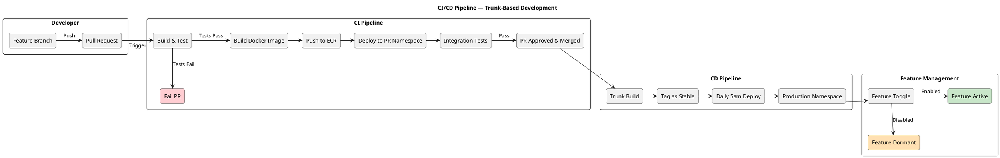

# AIR (Advice & Intelligence Relationship) System Architecture Design

## Level 1: System Context Diagram

Shows the AIR system in its environment, with external actors and systems.

```plantuml
@startuml AIR_System_Context
!include https://raw.githubusercontent.com/plantuml-stdlib/C4-PlantUML/master/C4_Context.puml

LAYOUT_WITH_LEGEND()
LAYOUT_LEFT_RIGHT()

title AIR System Context Diagram

' === Tier 1: Actors (leftmost) ===
Person(advisor, "Financial Advisor", "Uses AIR to manage opportunities, build proposals, and deliver advice to clients")
Person(supervisor, "Supervisor", "Reviews and approves advice cases, monitors advisor activity")
Person(admin, "Administrator", "Manages system configuration, user access, and operations")

' === Tier 2/3/4: Core System ===
System(air, "AIR Platform", "Advice & Intelligence Relationship platform — modular monolith providing opportunity management, advice construction, compliance validation, and AI-assisted advisory support")

' === Tier 5: External Systems (rightmost) ===
System_Ext(entraId, "Microsoft Entra ID", "Corporate identity provider — OAuth2/OIDC authentication and role-based access")
System_Ext(pep, "AdviceConsumer (via PEP)", "Enterprise API Gateway (Policy Enforcement Point) — source of leads and fulfilment execution")
System_Ext(clientSystems, "Client Data Sources", "Upstream systems providing Customer 360 data (financial position, risk profile, relationships)")

' === Relationships: Actors -> System ===
Rel(advisor, air, "Manages opportunities, builds proposals, engages clients", "HTTPS/Browser")
Rel(supervisor, air, "Reviews cases, approves advice, monitors compliance", "HTTPS/Browser")
Rel(admin, air, "Configures system, manages users", "HTTPS/Browser")

' === Relationships: System -> External ===
Rel(air, entraId, "Authenticates users, validates JWT tokens", "OAuth2/PKCE")
Rel(air, pep, "Syncs leads, executes deals", "REST/JSON via PEP")
Rel(air, clientSystems, "Retrieves client profiles and financial data", "REST/JSON")

@enduml
```

## Level 2: Container Diagram

Shows the major deployable units and their interactions.

```plantuml
@startuml AIR_Container
!include https://raw.githubusercontent.com/plantuml-stdlib/C4-PlantUML/master/C4_Container.puml

LAYOUT_WITH_LEGEND()
LAYOUT_LEFT_RIGHT()

skinparam linetype polyline

title AIR Container Diagram

' === Tier 1: Actors (leftmost) ===
Person(advisor, "Financial Advisor", "Primary user of the AIR platform")

' === Tier 2: Presentation Layer ===
System_Ext(cloudfront, "AWS CloudFront", "CDN for Angular SPA")
System_Ext(s3, "AWS S3", "Static hosting for Angular assets")

System_Boundary(airSystem, "AIR Platform") {

    ' === Tier 2: Presentation ===
    Container(spa, "Angular SPA", "Angular 19+, TypeScript", "Single-page application providing advisor workbench, opportunity management, advice case workspace, proposal builder, and dashboards")

    ' === Tier 3/4: API + Service Layer ===
    Container(api, "AIR API (Modular Monolith)", "Java 21, Spring Boot 4.x", "REST API hosting all bounded context modules — workbench, opportunity, advice lifecycle, proposal builder, compliance rules, engagement, document & acceptance, advisor productivity")

    ' === Tier 4: AI Agent Services ===
    Container(bob, "Bob Agent", "Spring AI", "Advisor's personal assistant — cross-context agent providing queue reasoning, proposal drafting, engagement prep, notebook interpretation, and general advisory support")
    Container(vera, "Vera Agent", "Spring AI + Rules Engine", "Compliance agent — validates proposals (sync), enforces suitability checks, flags risks")

    ' === Tier 5: Data Layer (rightmost) ===
    Container(eventBus, "Internal Event Bus", "Spring Application Events", "In-process event backbone for cross-module communication, agent orchestration, and workbench projection updates")
    ContainerDb(db, "PostgreSQL Database", "AWS RDS PostgreSQL 15+", "Stores opportunities, advice cases, proposals, compliance artefacts, engagement records, notebook, audit trail")
}

' === Tier 5: External Data/Services (rightmost) ===
System_Ext(entraId, "Microsoft Entra ID", "Identity & access management")
System_Ext(pep, "AdviceConsumer (via PEP)", "Enterprise API Gateway — lead sync & deal execution")

' === Relationships: Tier 1 -> Tier 2 ===
Rel(advisor, cloudfront, "Accesses application", "HTTPS")
Rel(cloudfront, s3, "Serves static assets", "HTTPS")
Rel(cloudfront, api, "Proxies API calls", "/api/*")

' === Relationships: Tier 2 -> Tier 3/4 ===
Rel(spa, api, "Calls REST endpoints", "HTTPS/JSON + Bearer JWT")
Rel(spa, entraId, "Authenticates via MSAL", "OAuth2/PKCE")

' === Relationships: Tier 3/4 -> Tier 5 ===
Rel(api, db, "Reads/writes domain data", "JDBC/SQL")
Rel(api, pep, "Syncs leads, executes deals", "REST/JSON via PEP + Circuit Breaker")
Rel(api, entraId, "Validates JWT tokens", "JWKS")
Rel(api, eventBus, "Publishes/subscribes domain events", "In-process")

' === Relationships: Event Bus -> Agents ===
Rel(eventBus, bob, "Routes events", "AdviceCaseCreated, ProposalSectionEdited, LeadSignalDetected, EngagementSummaryAvailable")
Rel(eventBus, vera, "Routes events", "ProposalCompleted (sync validation gate)")

' === Relationships: Agents -> API ===
Rel(bob, api, "Produces suggestions/drafts, reads from all context modules", "In-process")
Rel(vera, api, "Returns validations/violations", "In-process")

@enduml
```

## Level 3: Component Diagram — AIR API (Modular Monolith)

Shows the internal module structure of the monolith, aligned to the revised bounded contexts.

```plantuml
@startuml AIR_API_Components
!include https://raw.githubusercontent.com/plantuml-stdlib/C4-PlantUML/master/C4_Component.puml

LAYOUT_WITH_LEGEND()
LAYOUT_LEFT_RIGHT()

skinparam linetype polyline

title AIR API — Modular Monolith Component Diagram

Container_Boundary(api, "AIR API (Modular Monolith)") {

    ' === Cross-cutting services ===
    together {
        Component(featureToggles, "Feature Toggle Service", "Spring Boot + Config", "Controls feature flags to decouple deployments from business releases")
    }

    ' === Core Domain Modules ===
    Component(workbenchModule, "Advisor Workbench Module", "Spring Boot Module", "Priority queue presentation, performance scorecard, aggregated read projection for Bob's context window, advisor day schedule")
    Component(opportunityModule, "Opportunity & Portfolio Module", "Spring Boot Module", "Manages leads, opportunities, scoring, pipeline classification, feedback, and the Next-Best-Action Prioritisation Service")
    Component(clientModule, "Client Context Module (Customer 360)", "Spring Boot Module", "Read-only consolidated view of client profiles, financial position, money flows, risk profiles, FNA inputs")
    Component(lifecycleModule, "Advice Case Lifecycle Module", "Spring Boot Module", "Orchestrates advice case stages, owns the Opportunity Setup wizard, manages stage transitions and outcome anchors")
    Component(proposalModule, "Advice Construction Module (Proposal Builder)", "Spring Boot Module", "Builds and versions proposals and Record of Advice — sections, calculations, diffs, template progression")
    Component(rulesModule, "Compliance Rules Module", "Spring Boot Module", "Synchronous validation — suitability checks, mandate validation, risk profile mismatch, FICA gaps, disclosure requirements")

    ' === Supporting Domain Modules ===
    Component(engagementModule, "Client Engagement Module", "Spring Boot Module", "Captures structured client interactions — recordings, transcripts, summaries, objectives, consent")
    Component(documentModule, "Document & Acceptance Module", "Spring Boot Module", "Generates final artefacts (PDFs, RoA), tracks client acceptance, manages compliance artefact versioning")
    Component(productivityModule, "Advisor Productivity Module", "Spring Boot Module", "Notebook, voice dictation, photo attachments, saved notes library, Bob interpretation requests")

    ' === Event Bus ===
    Component(eventBus, "Event Bus", "Spring Application Events", "In-process event backbone for cross-module communication and agent orchestration")
}

' === External Systems ===
together {
    ContainerDb(db, "PostgreSQL", "AWS RDS", "Each module owns its schema/tables via Liquibase")
    System_Ext(pep, "AdviceConsumer (via PEP)", "Enterprise API Gateway — lead sync & deal execution")
    System_Ext(clientSystems, "Client Data Sources", "Customer 360 data")
}

' === Relationships: Modules -> Event Bus ===
Rel(opportunityModule, eventBus, "Publishes LeadSignalDetected, LeadPromotedToQueue, LeadFeedbackRecorded, OpportunityReadyForEngagement, QueueRanked")
Rel(lifecycleModule, eventBus, "Publishes AdviceCaseCreated, StageAdvanced, CaseCompleted")
Rel(proposalModule, eventBus, "Publishes ProposalSectionEdited, ProposalCompleted")
Rel(engagementModule, eventBus, "Publishes EngagementCaptured, EngagementSummaryAvailable")
Rel(documentModule, eventBus, "Publishes ClientAccepted, DocumentGenerated")
Rel(rulesModule, eventBus, "Publishes ValidationCompleted")

' === Relationships: Event Bus -> Consuming Modules ===
Rel(eventBus, workbenchModule, "Subscribes to queue/lifecycle/ranking events for projection updates")
Rel(eventBus, lifecycleModule, "Subscribes to OpportunityReadyForEngagement, ValidationCompleted, ClientAccepted")
Rel(eventBus, rulesModule, "Subscribes to ProposalCompleted (sync validation gate)")

' === Relationships: Module -> Module (direct reads) ===
Rel(workbenchModule, opportunityModule, "Reads ranked queue from Prioritisation Service")
Rel(workbenchModule, lifecycleModule, "Reads active engagements and stage positions")
Rel(workbenchModule, clientModule, "Reads client metadata for display")
Rel(lifecycleModule, clientModule, "Reads FNA data for Setup wizard step 4")
Rel(proposalModule, clientModule, "Reads client financials for proposals")
Rel(opportunityModule, clientModule, "Receives behavioural signals")

' === Relationships: Modules -> External Services ===
Rel(opportunityModule, pep, "Syncs leads", "REST/JSON via PEP")
Rel(lifecycleModule, pep, "Executes fulfilment steps", "REST/JSON via PEP")
Rel(clientModule, clientSystems, "Retrieves client data", "REST/JSON")

' === Relationships: Modules -> Database ===
Rel(workbenchModule, db, "Reads/writes", "JDBC")
Rel(opportunityModule, db, "Reads/writes", "JDBC")
Rel(lifecycleModule, db, "Reads/writes", "JDBC")
Rel(proposalModule, db, "Reads/writes", "JDBC")
Rel(rulesModule, db, "Reads/writes", "JDBC")
Rel(engagementModule, db, "Reads/writes", "JDBC")
Rel(documentModule, db, "Reads/writes", "JDBC")
Rel(productivityModule, db, "Reads/writes", "JDBC")

@enduml
```

## Level 3: Component Diagram — AI Agents & Orchestration

Focused view of how Bob and Vera interact with the domain modules. Gary is deferred.

```plantuml
@startuml AIR_AI_Agents
!include https://raw.githubusercontent.com/plantuml-stdlib/C4-PlantUML/master/C4_Component.puml

LAYOUT_WITH_LEGEND()
LAYOUT_LEFT_RIGHT()

skinparam linetype polyline

title AI Agents & Orchestration — Component Diagram

' === Tier 4: Domain Modules (leftmost — they produce events and serve data) ===
Container_Boundary(modules, "Domain Modules") {
    Component(workbenchModule, "Advisor Workbench Module", "Spring Boot Module", "Aggregated read projection, queue presentation")
    Component(opportunityModule, "Opportunity & Portfolio Module", "Spring Boot Module", "Leads, scoring, prioritisation service")
    Component(proposalModule, "Proposal Builder Module", "Spring Boot Module", "Builds proposals and RoA")
    Component(lifecycleModule, "Advice Lifecycle Module", "Spring Boot Module", "Case lifecycle, setup wizard, stage transitions")
    Component(engagementModule, "Engagement Module", "Spring Boot Module", "Client interaction capture")
    Component(clientModule, "Client Context Module", "Spring Boot Module", "Customer 360 read model")
    Component(rulesModule, "Compliance Rules Module", "Spring Boot Module", "Deterministic rule enforcement")
    Component(documentModule, "Document & Acceptance Module", "Spring Boot Module", "Document generation, client acceptance")
    Component(productivityModule, "Advisor Productivity Module", "Spring Boot Module", "Notebook, dictation, notes library")
}

' === Agent Layer ===
Container_Boundary(agents, "AI Agent Layer") {

    

    Component(orchestrator, "Advice Lifecycle Orchestrator", "Spring Service", "Tracks lifecycle state, triggers validations, ensures required steps are completed, enforces policy gates")
    Component(bob, "Bob — Advisor's Personal Assistant", "Spring AI Agent", "Application-layer agent: drafts proposals, reasons about queue, preps engagements, interprets notes, provides general advisory support. Cross-context read access.")
    Component(vera, "Vera — Compliance Agent", "Spring AI Agent + Rules Engine", "Domain service: validates proposals (sync), enforces suitability, flags risks. Deterministic, guardrail-focused.")
    Component(eventBus, "Event Bus", "Spring Application Events", "Routes domain events to agent subscriptions")
}

' === Relationships: Domain Modules -> Event Bus ===
Rel(opportunityModule, eventBus, "LeadSignalDetected, LeadPromotedToQueue, QueueRanked, OpportunityReadyForEngagement")
Rel(proposalModule, eventBus, "ProposalSectionEdited, ProposalCompleted")
Rel(lifecycleModule, eventBus, "AdviceCaseCreated, StageAdvanced, CaseCompleted")
Rel(engagementModule, eventBus, "EngagementCaptured, EngagementSummaryAvailable")
Rel(documentModule, eventBus, "ClientAccepted, DocumentGenerated")

' === Relationships: Event Bus -> Agents ===
Rel(eventBus, bob, "AdviceCaseCreated, ProposalSectionEdited, EngagementSummaryAvailable, LeadSignalDetected", "Async")

' === Relationships: Orchestrator -> Services ===
Rel(orchestrator, vera, "ValidateProposal, CheckSuitability (policy gate)", "Sync")
Rel(orchestrator, lifecycleModule, "Manages state transitions, enforces gates")

' === Relationships: Bob -> Domain Modules (reads) ===
Rel(bob, workbenchModule, "Reads aggregated projection for context window")
Rel(bob, opportunityModule, "Reads leads, scores, signals")
Rel_Left(bob, lifecycleModule, "Reads active cases, current stages")
Rel(bob, clientModule, "Reads client profiles, financials")
Rel(bob, engagementModule, "Reads past engagement sessions")
Rel(bob, rulesModule, "Reads compliance requirements for pre-emptive suggestions")
Rel(bob, documentModule, "Reads template requirements")
Rel(bob, productivityModule, "Reads notebook content for interpretation")

' === Relationships: Bob -> Domain Modules (writes) ===
Rel(bob, proposalModule, "Produces suggestions & drafts", "Write")
Rel(bob, workbenchModule, "Produces queue suggestions", "Write")
Rel(bob, opportunityModule, "Surfaces new leads", "Write")

' === Relationships: Vera -> Domain Modules ===
Rel(vera, rulesModule, "Executes rule validations")

@enduml
```

## Level 4: Deployment Diagram

Shows the physical deployment topology on AWS.

```plantuml
@startuml AIR_Deployment
!include https://raw.githubusercontent.com/plantuml-stdlib/C4-PlantUML/master/C4_Deployment.puml

LAYOUT_WITH_LEGEND()
LAYOUT_LEFT_RIGHT()

title AIR Deployment Diagram — AWS EKS

' === External Services (horizontally aligned) ===
together {
    Deployment_Node(entra, "Microsoft Entra ID", "Identity Provider") {
        Container(entraId, "Entra ID", "OAuth2/OIDC", "Corporate authentication, JWKS endpoint for token validation")
    }

    Deployment_Node(pep_node, "PEP (Policy Enforcement Point)", "Enterprise API Gateway — Same VPC / Peering") {
        Container(pepService, "AdviceConsumer API", "REST Service via PEP", "Lead sync source, deal execution target — accessed through enterprise API gateway")
    }
}

' === Tier 2: Presentation Layer ===
Deployment_Node(aws, "AWS Cloud", "Amazon Web Services") {

    Deployment_Node(cloudfront_node, "CloudFront", "CDN") {
        Container(cdn, "CloudFront Distribution", "AWS CloudFront", "Routes /api/* to ALB, serves static assets from S3")
    }

    Deployment_Node(s3_node, "S3 Bucket", "Static Hosting") {
        Container(angular, "Angular SPA", "Angular 19+ build artefacts", "Advisor workbench, dashboards, proposal builder UI")
    }

    ' === Tier 3: API / Ingress Layer ===
    Deployment_Node(vpc, "VPC (Private)", "AWS VPC") {

        Deployment_Node(eks, "EKS Cluster", "Kubernetes 1.28+") {

            Deployment_Node(alb_node, "ALB", "AWS Application Load Balancer") {
                Container(alb, "Ingress Controller", "AWS ALB Ingress", "TLS termination, path-based routing to pods")
            }

            ' === Tier 4: Service Layer (vertically aligned namespaces) ===
            together {
                Deployment_Node(ns_main, "Namespace: air-production", "Kubernetes Namespace") {
                    Container(pod1, "AIR API Pod (replica 1)", "Java 21, Spring Boot 4.x", "Modular monolith with all bounded context modules + Bob & Vera agents")
                    Container(pod2, "AIR API Pod (replica 2)", "Java 21, Spring Boot 4.x", "Horizontal scaling via HPA")
                }

                Deployment_Node(ns_pr, "Namespace: air-pr-env (x2-3)", "PR Environment") {
                    Container(prPod, "AIR API Pod (PR)", "Java 21, Spring Boot 4.x", "PR environment with mock/staging data loaded via Liquibase profiles")
                }
            }
        }

        ' === Tier 5: Data Layer (rightmost) ===
        Deployment_Node(rds_node, "RDS", "AWS RDS Multi-AZ") {
            ContainerDb(rds, "PostgreSQL 15+", "AWS RDS", "Multi-AZ, encrypted at rest, module-owned schemas")
        }

        Deployment_Node(ecr_node, "ECR", "Container Registry") {
            Container(ecr, "Container Images", "AWS ECR", "Docker images built via CI/CD pipeline")
        }
    }
}

' === Relationships: left-to-right flow ===
Rel(cdn, angular, "Serves static assets", "HTTPS")
Rel(cdn, alb, "Proxies /api/* requests", "HTTPS")
Rel(alb, pod1, "Routes traffic", "HTTP/8080")
Rel(alb, pod2, "Routes traffic", "HTTP/8080")
Rel(pod1, rds, "JDBC connections", "PostgreSQL/5432")
Rel(pod2, rds, "JDBC connections", "PostgreSQL/5432")
Rel(pod1, pepService, "REST calls via PEP with circuit breaker", "HTTPS")
Rel(pod1, entraId, "JWKS validation", "HTTPS")
Rel(prPod, rds, "Uses staging data profile", "PostgreSQL/5432")

@enduml
```

## CI/CD Pipeline Flow

Illustrates the trunk-based development and deployment pipeline.



## Event Flow Diagram

Shows the event-driven orchestration pattern aligned to the revised bounded contexts.

```plantuml
@startuml AIR_Event_Flow

skinparam linetype polyline

title Event-Driven Agent Orchestration (Revised)

skinparam rectangle {
    BackgroundColor<<bob>> #C8E6C9
    BorderColor<<bob>> #388E3C
    FontColor<<bob>> #1B5E20
    BackgroundColor<<vera>> #FFCDD2
    BorderColor<<vera>> #D32F2F
    FontColor<<vera>> #B71C1C
    BackgroundColor<<workbench>> #E3F2FD
    BorderColor<<workbench>> #1565C0
    FontColor<<workbench>> #0D47A1
    BackgroundColor<<lifecycle_con>> #FFF3E0
    BorderColor<<lifecycle_con>> #E65100
    FontColor<<lifecycle_con>> #BF360C
}


' === Row 1: Upper domain event sources ===
together {
    rectangle "Advice Case Lifecycle" as lifecycle_pub {
        rectangle "AdviceCaseCreated" as acc
        rectangle "StageAdvanced" as sa
        rectangle "CaseCompleted" as cc
    }

    rectangle "Advice Construction" as construction {
        rectangle "ProposalSectionEdited" as pse
        rectangle "ProposalCompleted" as pc
    }

    rectangle "Client Engagement" as engagement {
        rectangle "EngagementCaptured" as ec
        rectangle "EngagementSummaryAvailable" as esa
    }
}

' === Row 2: Lower domain event sources ===
together {
    rectangle "Opportunity & Portfolio" as opportunity {
        rectangle "LeadSignalDetected" as lsd
        rectangle "LeadPromotedToQueue" as lpq
        rectangle "LeadFeedbackRecorded" as lfr
        rectangle "OpportunityReadyForEngagement" as ore
        rectangle "QueueRanked" as qr
    }

    rectangle "Document & Acceptance" as document {
        rectangle "ClientAccepted" as ca
    }
}

' === Left side: Advisor Workbench ===
rectangle "Advisor Workbench\n(Projection Update)" <<workbench>> as workbench {
}

' === Right side: Vera + Lifecycle Consumer ===
rectangle "Vera\n(Sync Validation)" <<vera>> as vera {
}

rectangle "Lifecycle\n(Event Consumer)" <<lifecycle_con>> as lifecycle_con {
}

' === Bottom: Bob ===
rectangle "Bob — Advisor's Personal Assistant" <<bob>> as bob {
}

' === Relationships: Events -> Workbench (left) ===
lsd ..left..> workbench : async
lpq ..left..> workbench : async
qr ..left..> workbench : async
acc ..left..> workbench : async
sa ..left..> workbench : async
cc ..left..> workbench : async

' === Relationships: Events -> Vera (right) ===
pc ..right..> vera : sync\ncommand

' === Relationships: Vera -> Lifecycle Consumer ===
vera ..down..> lifecycle_con : ValidationCompleted\n(allow/block)

' === Relationships: Events -> Lifecycle Consumer (right) ===
ore ..right..> lifecycle_con : triggers\nSetup wizard
ca ..right..> lifecycle_con : advance to\nfulfilment

' === Relationships: Events -> Bob (bottom) ===
lsd ..down..> bob : surface\nopportunity
lfr ..down..> bob : learning\nsignal
acc ..down..> bob : prepare\ndraft
sa ..down..> bob : context\nshift
pse ..down..> bob : suggest\ncontent
ec ..down..> bob : update\ncontext
esa ..down..> bob : update\ncontext

@enduml
```



---

## Diagram Summary

| Level | Diagram | Purpose |
|-------|---------|---------|
| C4 Level 1 | System Context | Shows AIR in its ecosystem with users and external systems |
| C4 Level 2 | Container | Shows deployable units — SPA, API monolith, DB, Bob & Vera agents, event bus |
| C4 Level 3 | Component (API) | Shows internal bounded context modules within the monolith (9 active contexts) |
| C4 Level 3 | Component (Agents) | Shows Bob's cross-context read/write access and Vera's sync validation role |
| C4 Level 4 | Deployment | Shows AWS infrastructure topology — EKS, RDS, CloudFront, S3 |
| Supplementary | CI/CD Pipeline | Shows trunk-based development and daily deployment flow |
| Supplementary | Event Flow | Shows event-driven orchestration with revised event catalogue |

---

## Key Architecture Characteristics

- **Modular Monolith**: All bounded contexts deployed as a single unit for speed, with explicit module boundaries for future decomposition
- **9 Active Bounded Contexts**: Advisor Workbench, Opportunity & Portfolio, Client Context, Advice Case Lifecycle, Advice Construction, Compliance Rules, Client Engagement, Document & Acceptance, Advisor Productivity
- **Bob as Application-Layer Agent**: Cross-context personal assistant with read access to all modules and write access to Proposal Builder, Workbench, and Opportunity
- **Vera as Domain Service**: Synchronous compliance validation within the Compliance Rules module; async monitoring deferred
- **Gary Deferred**: Professional coach agent deferred to future phase (Monitoring & Assurance context)
- **Prioritisation Service in Opportunity & Portfolio**: The Next-Best-Action ranking algorithm lives as a domain service within the Opportunity module, publishing ranked results to the Workbench projection
- **Opportunity Setup Wizard in Lifecycle**: Triggered by `OpportunityReadyForEngagement` event from Opportunity, owned by Advice Case Lifecycle
- **Event-Driven Backbone**: 13 domain events orchestrate cross-module communication and agent behaviour
- **Policy Gates**: Critical state transitions (e.g. CompleteProposal) go through synchronous Vera validation
- **AI Cannot Change State**: Agents suggest, flag, and advise — humans approve and transition
- **Feature Toggles**: Decouple code deployment from business release
- **PR Environments**: Ephemeral namespaces with mock data for rapid feedback
- **Module-Owned Data**: Each module manages its own schema via Liquibase

---

## Alignment to Revised DDD

| Bounded Context | Module | Classification | Notes |
|---|---|---|---|
| Advisor Workbench | `workbenchModule` | Core | New — owns queue presentation, scorecard, aggregated read projection |
| Opportunity & Portfolio | `opportunityModule` | Core | Owns leads, scoring, pipeline, prioritisation service, feedback |
| Client Context (Customer 360) | `clientModule` | Core (read model) | Read-only projection of upstream client systems |
| Advice Case Lifecycle | `lifecycleModule` | Core | Owns stages, transitions, setup wizard, outcome anchors |
| Advice Construction | `proposalModule` | Core | Owns proposals, RoA, versioning, diffs |
| Compliance Rules | `rulesModule` | Core | Sync validation only; async monitoring deferred |
| Client Engagement | `engagementModule` | Supporting | Structured interaction capture linked to cases |
| Document & Acceptance | `documentModule` | Supporting | Merged from Acceptance + Document Output |
| Advisor Productivity | `productivityModule` | Supporting | New — notebook, dictation, notes library |

### Deferred Contexts (not represented in current architecture)

| Context | Reason | Future Home |
|---|---|---|
| Advisor Identity & Governance | Consumed from bank IAM (Entra ID) | External dependency |
| Compliance Monitoring | Vera's async mode not yet validated | Future module + event subscriptions |
| Monitoring & Assurance (Gary) | Coach agent not in MVP scope | Future module + agent |
| Deal Execution & Fulfilment | Absorbed into Lifecycle as terminal stage | Extract when complexity warrants |

---

## Glossary

| Term     | Definition                                                                                                                                    |
| -------- | --------------------------------------------------------------------------------------------------------------------------------------------- |
| PEP      | Policy Enforcement Point — the enterprise API gateway through which external service calls are routed                                         |
| AIR      | Advice & Intelligence Relationship — the platform being designed                                                                              |
| Bob      | AI personal assistant agent — advisor's cross-context co-pilot (proposal drafting, queue reasoning, engagement prep, notebook interpretation) |
| Vera     | AI compliance agent — synchronous rule validation and suitability enforcement                                                                 |
| Gary     | AI professional coach agent — behavioural analysis and coaching insights (deferred)                                                           |
| RoA      | Record of Advice — regulatory documentation of advice given                                                                                   |
| FNA      | Financial Needs Analysis — client assessment inputs                                                                                           |
| HPA      | Horizontal Pod Autoscaler — Kubernetes auto-scaling mechanism                                                                                 |
| NBA      | Next-Best-Action — the prioritised recommendation for what an advisor should do next                                                          |
| QTD      | Quarter-to-Date — performance measurement period                                                                                              |
| GAP      | Pre-signature opportunity (not yet in pipeline)                                                                                               |
| Pipeline | Post-signature, pre-fulfilment opportunity (committed revenue)                                                                                |
