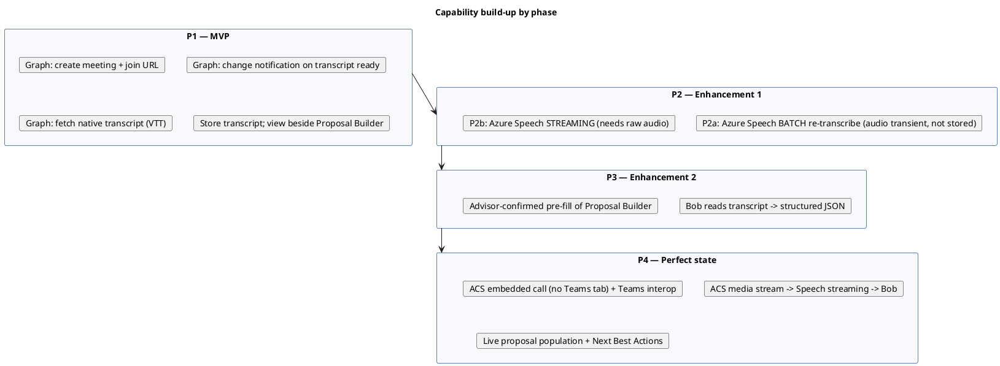
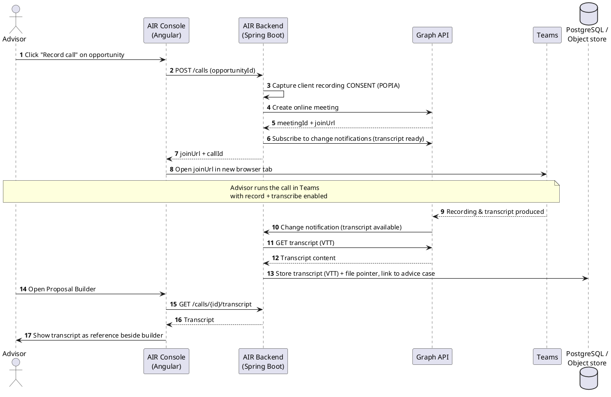
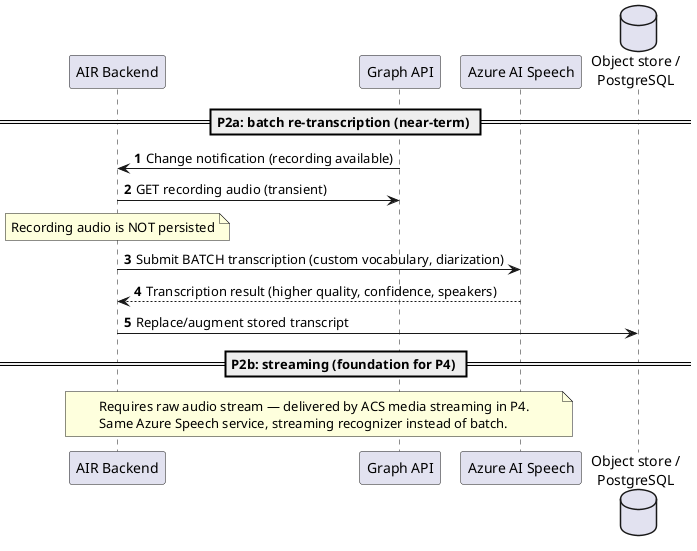
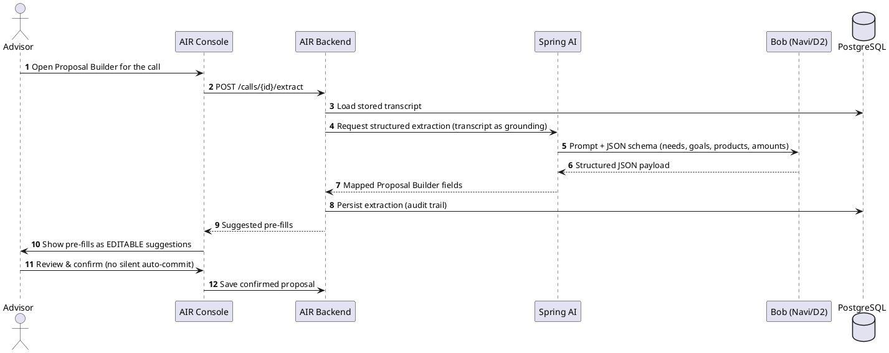
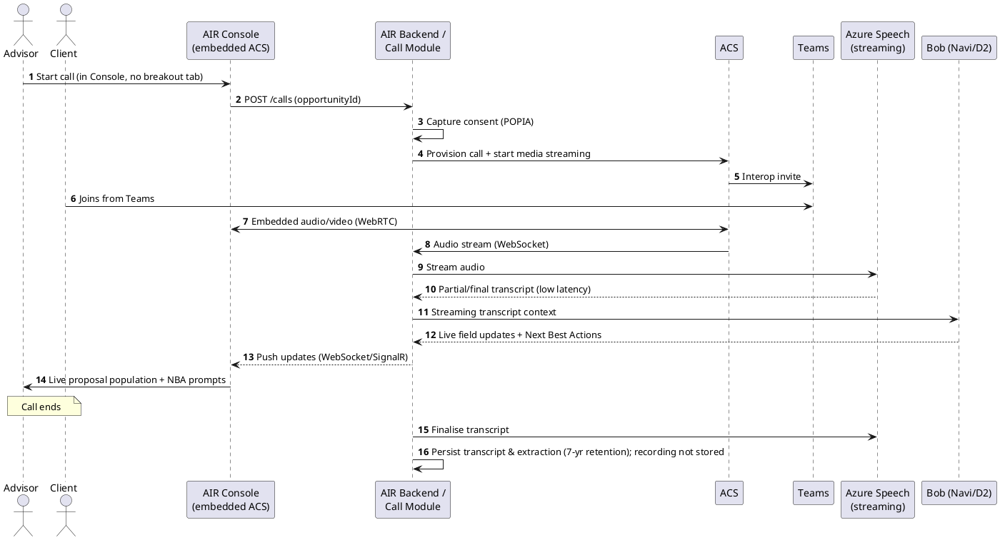

# Technology Selection Memo — Call Recording, Transcription & Proposal Builder Integration

> **Status**: Draft for review
> **Audience**: AIR architecture forum / segment CIO office
> **Author**: AIR Engineering
> **Date**: July 2026

---

## 1. Executive summary

We want AIR advisors to launch a Microsoft Teams call from the AIR Console, record and
transcribe the conversation, store the transcript, and later surface it inside the
Interactive Proposal Builder as reference material. Beyond that baseline we want to
progressively improve transcription quality, have our AI agent (**Bob**, on Navi/D2) mine
the transcript to prepopulate the proposal, and ultimately run the whole thing in real time
inside the Console with no Teams breakout tab.

This memo recommends a **phased technology selection** rather than a single big-bang build:

| Phase | Outcome | Primary technology | Effort / risk |
|-------|---------|--------------------|---------------|
| **P1 — MVP** | Launch Teams call, native transcription, store & view transcript | **Microsoft Graph API** (online meetings, change notifications, transcripts) | Low |
| **P2 — Enhancement 1** | Higher-quality transcription | **Azure AI Speech** (batch first, then streaming) | Medium |
| **P3 — Enhancement 2** | Bob extracts data & prepopulates proposal | **Azure OpenAI via Navi/D2 (Bob)** + structured extraction | Medium |
| **P4 — Perfect state** | Embedded real-time call + live proposal + Next Best Actions | **Azure Communication Services (ACS)** + Graph interop + Speech + Bob | High |

The through-line: **Graph API owns the meeting lifecycle and stored artefacts; ACS owns
embedded, programmable, real-time calling; Azure Speech owns audio-to-text; Bob owns
meaning extraction.** Picking these four building blocks now lets each phase reuse the
previous one rather than throwing work away.

---

## 2. Problem statement & objectives

**Today** advisors dictate or manually note what happened on a client call, then rekey it
into the proposal. That is slow, lossy, and hard to audit.

**Objectives**

1. One-click call launch from the Console tied to the current lead/opportunity.
2. Reliable capture of a transcript, with consent, stored against the advice case.
3. Transcript viewable as reference alongside the Proposal Builder.
4. Progressive automation: better transcripts → AI extraction → real-time assistance.

**Constraints (regulatory & platform)**

- **POPIA** — lawful basis and explicit client consent to record; data-subject rights.
- **FAIS** — advice records retained **7 years** (aligns with existing AIR audit retention).
- **FICA / data residency** — all processing and storage runs on **FNB's on-premises Azure
  instance**; keep PII within the FNB-managed footprint.
- Must fit the existing AIR estate: **Entra ID** identity, **Angular** Console, **Spring Boot**
  backend, **PostgreSQL**, **Navi/D2 (Bob)** for AI, routing through the enterprise gateway.

---

## 3. Technology selection

### 3.1 Meeting lifecycle & stored transcripts — Microsoft Graph API

**Selected for P1.** Graph is the native control plane for Teams. We use it to:

- Create the online meeting and obtain the **join URL** (deep link opened in a new tab).
- Subscribe to **change notifications** so we are told when a transcript/recording is ready,
  rather than polling.
- Fetch the **meeting transcript** (WebVTT) once available. We store only the transcript, not
  the recording.

Required Entra ID app registration with application permissions such as
`OnlineMeetings.Read.All`, `OnlineMeetingTranscript.Read.All`, `OnlineMeetingRecording.Read.All`
(scoped down via an application access policy to the advisor population).

**Why Graph and not ACS for P1:** Graph gives us Teams' own transcription for free and needs
no media plumbing. The advisor and client already have Teams. It is the lowest-risk path to a
stored transcript.

**Limitation that drives later phases:** Graph transcription quality is fixed (Teams' engine),
it is **post-call only**, and Graph does **not** give us the raw audio stream. Real-time and
higher-quality transcription therefore require a different tool — Azure Speech, fed by ACS.

### 3.2 Transcription quality — Azure AI Speech

**Selected for P2.** Azure AI Speech (Speech-to-Text) gives us control the Teams engine does
not: custom/financial vocabulary models, speaker diarization, punctuation, and confidence
scores. Two delivery modes, adopted in order:

- **P2a — Batch transcription (near-term, low risk).** Retrieve the Teams recording audio via
  Graph **transiently**, submit it to Azure Speech **batch transcription**, then discard the
  audio — only the improved transcript is persisted. No media-access plumbing; a clean quality
  win over native Teams transcription. Reuses everything from P1.
- **P2b — Streaming transcription (sets up P4).** Stream live call audio to Azure Speech for
  low-latency text. This needs access to the raw audio stream, which Graph does not provide —
  hence ACS (below).

### 3.3 Meaning extraction & proposal prepopulation — Azure OpenAI via Bob (Navi/D2)

**Selected for P3.** We already integrate with **Navi/D2** where **Bob** runs. Bob reads the stored transcript and returns a **structured JSON payload** mapped to
Proposal Builder fields (needs, goals, risk appetite, products discussed, amounts). The Console
presents these as **suggested pre-fills the advisor confirms** — never silent auto-commit, which
matters for FAIS accountability.

### 3.4 Embedded, real-time calling — Azure Communication Services

**Selected for P4 (perfect state).** To remove the Teams breakout tab and embed the call in the
Console, we need programmable calling in our own UI. That is exactly ACS:

- **ACS Calling SDK + UI Library** embedded in the Angular Console — call surface lives inside AIR.
- **ACS ↔ Teams interoperability** so the client can still join from Teams while the advisor is
  in-Console; we keep Teams reach without owning a client install.
- **ACS Call Automation with media streaming** exposes bidirectional **audio over WebSocket**,
  which we pipe to **Azure Speech (streaming)** → **Bob** for live extraction and **Next Best
  Action** suggestions surfaced back to the Console (WebSocket/SignalR).

**Why not stay on Graph for P4:** Graph's real-time media (application-hosted media bots) is a
heavyweight, server-side media path and is not designed to embed a call UI in a custom SPA. ACS
is Microsoft's supported route for embedded, programmable calling and shares the same identity
and Teams fabric, so it composes with the earlier phases instead of replacing them.

### 3.5 Storage

- **Transcript text / structured extraction** → PostgreSQL (module-owned schema, keyed to the
  advice case), enabling query, display, and audit.
- **Transcript file (raw VTT)** → object storage on **FNB's on-premises Azure instance** or the
  existing **ECM** document service, with a pointer row in PostgreSQL. Keeps the DB lean and
  satisfies the 7-year retention requirement with lifecycle policies.
- **The call recording is not stored.** Where audio is required for re-transcription (P2a) it is
  retrieved transiently from Graph and discarded once the transcript is produced.

---

## 4. Logical architecture

### 4.1 Target ("perfect") state — C4 container view

The diagram below shows the full target estate. Earlier phases are strict subsets of it —
components introduced later are annotated with the phase that first requires them.

```plantuml
@startuml Call_Transcription_Target_Container
!include https://raw.githubusercontent.com/plantuml-stdlib/C4-PlantUML/master/C4_Container.puml

LAYOUT_WITH_LEGEND()
skinparam linetype polyline

title Call Recording & Transcription — Target Container Diagram

Person(advisor, "Financial Advisor", "Launches the call and builds the proposal in AIR Console")
Person(client, "Client", "Joins from Microsoft Teams (interop)")

System_Boundary(air, "AIR Platform") {
    Container(spa, "AIR Console (Angular SPA)", "Angular, TypeScript", "Proposal Builder + embedded ACS call surface (P4). Shows transcript & Bob suggestions.")
    Container(api, "AIR Backend (Spring Boot)", "Java 21", "Orchestrates meetings, consent, transcript storage, extraction requests")
    Container(callSvc, "Call & Transcription Module", "Spring Boot component", "Graph meeting lifecycle, notification handling, transcript retrieval, media-stream bridge (P4)")
    Container(springAi, "Spring AI Component", "Java 21, Spring AI", "Builds extraction/NBA requests to Bob")
    ContainerDb(db, "PostgreSQL", "RDS", "Transcripts, extraction results, consent & audit, file pointers")
    ContainerDb(blob, "Object Store / ECM", "FNB on-prem Azure", "Transcript files (VTT), 7-yr retention")
}

System_Ext(graph, "Microsoft Graph API", "Online meetings, change notifications, transcripts")
System_Ext(acs, "Azure Communication Services", "Embedded Calling SDK/UI + Call Automation media streaming (P4)")
System_Ext(teams, "Microsoft Teams", "Client join via ACS↔Teams interop")
System_Ext(speech, "Azure AI Speech", "Batch (P2a) & streaming (P2b/P4) speech-to-text")
System_Ext(bob, "Navi / D2 — Bob", "Azure OpenAI agent: extraction (P3) & Next Best Actions (P4)")
System_Ext(entra, "Microsoft Entra ID", "Identity, app registration, tokens")

Rel(advisor, spa, "Records call, builds proposal", "HTTPS")
Rel(client, teams, "Joins meeting", "Teams")
Rel(spa, api, "REST", "HTTPS/JSON")
Rel(spa, acs, "Embedded call (P4)", "ACS Calling SDK / WebRTC")
Rel(api, callSvc, "delegates")
Rel(callSvc, graph, "Create meeting, subscribe, fetch transcript (audio transiently for P2a)", "REST")
Rel(callSvc, acs, "Provision call, start media streaming (P4)", "REST/WebSocket")
Rel(acs, teams, "Interop join", "Teams fabric")
Rel(callSvc, speech, "Batch job (P2a) / audio stream (P2b/P4)", "REST/WebSocket")
Rel(callSvc, blob, "Store transcript file (VTT)", "HTTPS")
Rel(callSvc, db, "Persist transcript & metadata")
Rel(springAi, bob, "Extraction & NBA requests", "REST/JSON")
Rel(api, springAi, "delegates AI work")
Rel(spa, api, "Live suggestions channel (P4)", "WebSocket/SignalR")
Rel_R(api, entra, "Auth & token acquisition", "OAuth2")

@enduml
```

### 4.2 Phase mapping (what turns on when)



---

## 5. Sequence diagrams

### 5.1 P1 (MVP) — launch, native transcription, store, view



### 5.2 P2 (Enhancement 1) — higher-quality transcription via Azure Speech



### 5.3 P3 (Enhancement 2) — Bob extracts data & prepopulates the proposal



### 5.4 P4 (Perfect state) — embedded real-time call, live proposal & Next Best Actions



---

## 6. Cross-cutting concerns

### 6.1 Security & identity
- Single Entra ID app registration; **least-privilege** Graph application permissions scoped to the
  advisor population via an application access policy.
- Secrets (client credentials, ACS connection string, Speech & OpenAI keys) in the platform secret
  store — never in source or config committed to the repo.
- Graph **change-notification endpoints must validate** the validation token and notification
  signature; treat inbound notifications as untrusted until verified.
- ACS user access tokens minted server-side, short-lived, scoped to a single call.

### 6.2 Compliance (POPIA / FAIS / FICA)
- **Consent-gate before any recording starts** — capture and store the client's explicit consent;
  block the record path if absent. Surface the standard recording disclosure.
- Retain **transcripts 7 years** to match FAIS advice-record rules; apply object-store lifecycle
  policies for expiry. The call recording is not retained.
- Keep all processing and storage on **FNB's on-premises Azure instance**; document any egress
  for the DPIA.
- AI extraction is **decision-support only** — the advisor confirms every pre-filled value, keeping
  a human accountable for the advice record.

### 6.3 Cost model (indicative, validate before commit)
- **Graph API** — no per-call charge; cost is engineering + licensing already held.
- **Azure Speech** — billed per audio hour; batch cheaper than real-time streaming.
- **Azure OpenAI (Bob)** — billed per token; batch extraction is bounded, real-time NBA is chattier.
- **ACS** — billed per participant-minute plus media-streaming egress; the main new run-cost in P4.

Cost rises sharply from P1→P4; each phase should be justified by measured advisor value before the
next is funded.

### 6.4 Key risks & dependencies
- **Azure service availability on FNB's on-premises Azure instance** must be confirmed early:
  Azure Speech supports on-prem via connected/disconnected containers, but **ACS is typically a
  public-cloud service** — its availability (or an approved egress path) on the FNB footprint is a
  gating dependency for P4. Bob already runs on Navi/D2, so extraction is covered.
- **Raw audio access** is the pivotal constraint: Graph cannot provide it, so real-time quality and
  live assistance are gated on the ACS media-streaming path (P2b/P4).
- **ACS↔Teams interop** feature coverage and licensing must be confirmed against the tenant.
- **Latency budget** for P4 (audio → Speech → Bob → UI) needs a spike before committing to live NBA.
- **Graph transcript availability lag** (minutes post-call) is acceptable for P1–P3 but not P4.

---

## 7. Recommendation

Adopt the four building blocks — **Graph API, Azure Speech, Bob/Navi-D2, and ACS** — and deliver in
the phased order above. Start P1 on Graph now: it proves the workflow end-to-end at low cost and
risk, and every later phase builds on it rather than replacing it. Gate P2b and P4 (the ACS
media-streaming investment) behind a latency/cost spike and demonstrated value from P1–P3.

**Immediate next steps**
1. Confirm Entra ID app-registration and Graph permission approvals with platform security.
2. Confirm ACS licensing and ACS↔Teams interop availability on the tenant (de-risks P4 early).
3. Run a POPIA/DPIA review of the consent, storage, and retention design.
4. Build P1 as a thin vertical slice against one opportunity type.
```
