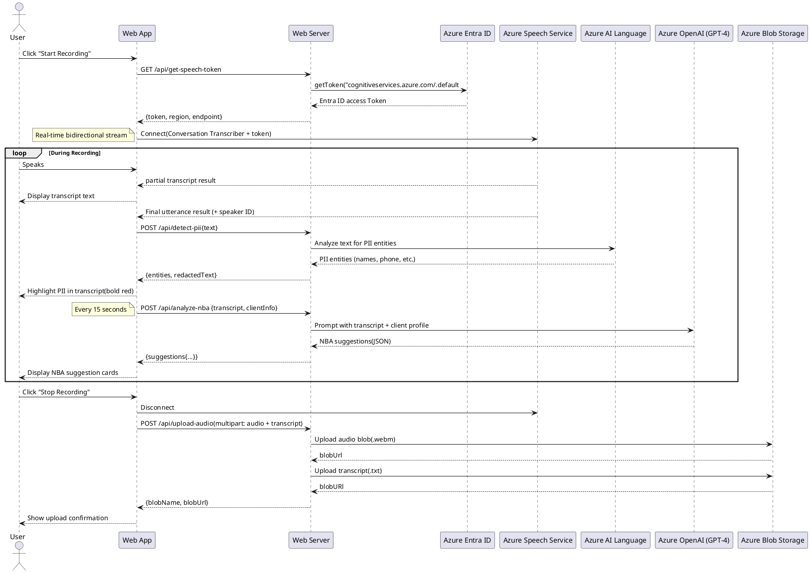

```puml
@startuml  
actor User as user  
participant "Web App" as web  
participant "Web Server" as express  
participant "Azure Entra ID" as entraId  
participant "Azure Speech Service" as speechService  
participant "Azure AI Language" as lang  
participant "Azure OpenAI (GPT-4)" as oai  
participant "Azure Blob Storage" as blob  
  
user -> web: Click "Start Recording"  
web -> express: GET /api/get-speech-token  
express -> entraId: getToken("cognitiveservices.azure.com/.default  
express <-- entraId: Entra ID access Token  
web <-- express: {token, region, endpoint}  
web -> speechService: Connect(Conversation Transcriber + token)  
  
note left: Real-time bidirectional stream  
  
loop During Recording  
user -> web: Speaks  
web <-- speechService: partial transcript result  
user <-- web: Display transcript text  
web <-- speechService: Final utterance result (+ speaker ID)  
  
web -> express: POST /api/detect-pii{text}  
express -> lang: Analyze text for PII entities  
express <-- lang: PII entities (names, phone, etc.)  
web <-- express: {entities, redactedText}  
user <-- web : Highlight PII in transcript(bold red)  
  
web -> express: POST /api/analyze-nba {transcript, clientInfo}  
note left: Every 15 seconds  
express -> oai: Prompt with transcript + client profile  
express <-- oai: NBA suggestions(JSON)  
web <-- express: {suggestions{...}}  
user <-- web: Display NBA suggestion cards  
  
end  
  
user -> web: Click "Stop Recording"  
web -> speechService: Disconnect  
web -> express: POST /api/upload-audio(multipart: audio + transcript)  
express -> blob: Upload audio blob(.webm)  
express <-- blob: blobUrl  
express -> blob: Upload transcript(.txt)  
express <-- blob: blobURl  
web <-- express: {blobName, blobUrl}  
user <-- web: Show upload confirmation  
@enduml
```
