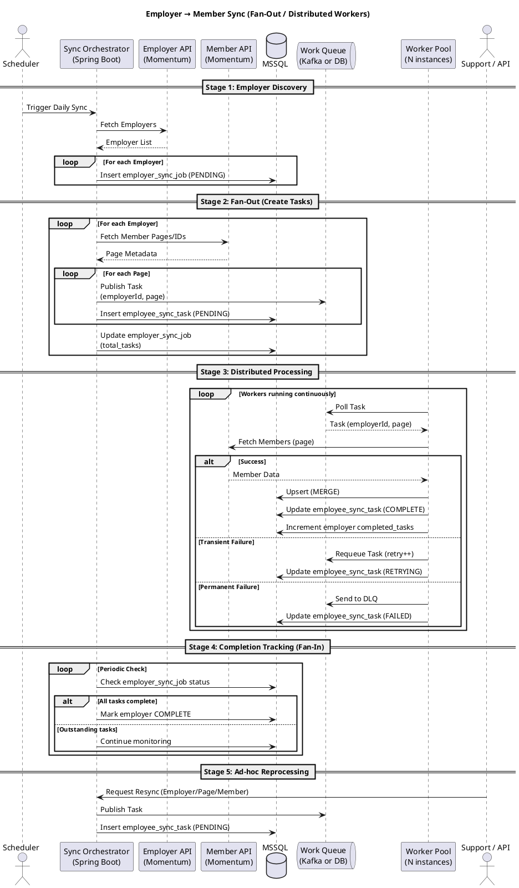

```puml
@startuml  
title Employer → Member Sync (Fan-Out / Distributed Workers)  
  
actor Scheduler  
participant "Sync Orchestrator\n(Spring Boot)" as Orchestrator  
participant "Employer API\n(Momentum)" as EmployerAPI  
participant "Member API\n(Momentum)" as MemberAPI  
database "MSSQL" as DB  
queue "Work Queue\n(Kafka or DB)" as Queue  
participant "Worker Pool\n(N instances)" as Workers  
  
== Stage 1: Employer Discovery ==  
  
Scheduler -> Orchestrator : Trigger Daily Sync  
Orchestrator -> EmployerAPI : Fetch Employers  
EmployerAPI --> Orchestrator : Employer List  
  
loop For each Employer  
    Orchestrator -> DB : Insert employer_sync_job (PENDING)  
end  
  
== Stage 2: Fan-Out (Create Tasks) ==  
  
loop For each Employer  
    Orchestrator -> MemberAPI : Fetch Member Pages/IDs  
    MemberAPI --> Orchestrator : Page Metadata  
  
    loop For each Page  
        Orchestrator -> Queue : Publish Task\n(employerId, page)  
        Orchestrator -> DB : Insert employee_sync_task (PENDING)  
    end  
  
    Orchestrator -> DB : Update employer_sync_job\n(total_tasks)  
end  
  
== Stage 3: Distributed Processing ==  
  
loop Workers running continuously  
    Workers -> Queue : Poll Task  
    Queue --> Workers : Task (employerId, page)  
  
    Workers -> MemberAPI : Fetch Members (page)  
  
    alt Success  
        MemberAPI --> Workers : Member Data  
        Workers -> DB : Upsert (MERGE)  
        Workers -> DB : Update employee_sync_task (COMPLETE)  
        Workers -> DB : Increment employer completed_tasks  
  
    else Transient Failure  
        Workers -> Queue : Requeue Task (retry++)  
        Workers -> DB : Update employee_sync_task (RETRYING)  
  
    else Permanent Failure  
        Workers -> Queue : Send to DLQ  
        Workers -> DB : Update employee_sync_task (FAILED)  
    end  
end  
  
== Stage 4: Completion Tracking (Fan-In) ==  
  
loop Periodic Check  
    Orchestrator -> DB : Check employer_sync_job status  
  
    alt All tasks complete  
        Orchestrator -> DB : Mark employer COMPLETE  
    else Outstanding tasks  
        Orchestrator -> DB : Continue monitoring  
    end  
end  
  
== Stage 5: Ad-hoc Reprocessing ==  
  
actor "Support / API" as Support  
  
Support -> Orchestrator : Request Resync (Employer/Page/Member)  
Orchestrator -> Queue : Publish Task  
Orchestrator -> DB : Insert employee_sync_task (PENDING)  
  
@enduml
```
