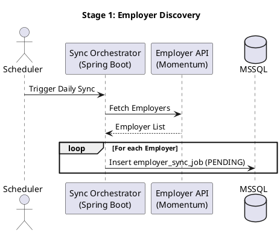
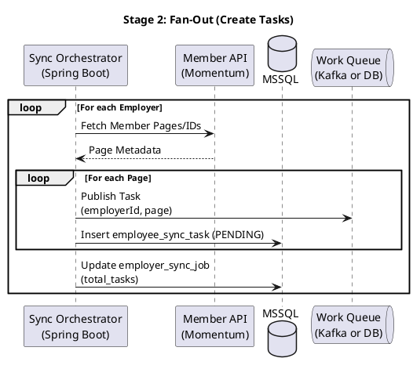
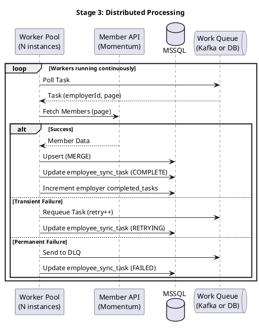
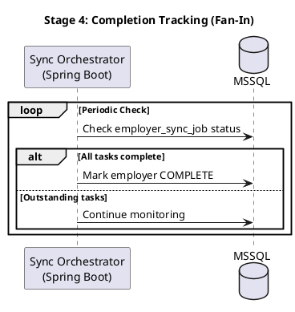
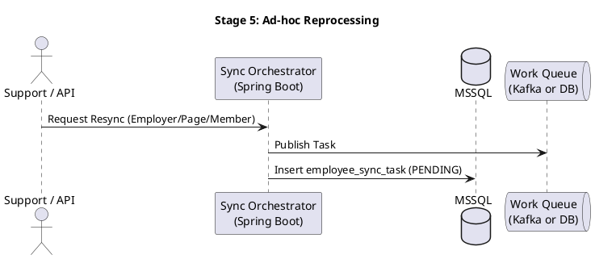

# Stage 1: Employer Discovery

```puml
@startuml
title Stage 1: Employer Discovery

actor Scheduler
participant "Sync Orchestrator\n(Spring Boot)" as Orchestrator
participant "Employer API\n(Momentum)" as EmployerAPI
database "MSSQL" as DB

Scheduler -> Orchestrator : Trigger Daily Sync
Orchestrator -> EmployerAPI : Fetch Employers
EmployerAPI --> Orchestrator : Employer List

loop For each Employer
    Orchestrator -> DB : Insert employer_sync_job (PENDING)
end

@enduml
```

---
# Stage 2: Fan-Out (Create Tasks)

```puml
@startuml
title Stage 2: Fan-Out (Create Tasks)

participant "Sync Orchestrator\n(Spring Boot)" as Orchestrator
participant "Member API\n(Momentum)" as MemberAPI
database "MSSQL" as DB
queue "Work Queue\n(Kafka or DB)" as Queue

loop For each Employer
    Orchestrator -> MemberAPI : Fetch Member Pages/IDs
    MemberAPI --> Orchestrator : Page Metadata

    loop For each Page
        Orchestrator -> Queue : Publish Task\n(employerId, page)
        Orchestrator -> DB : Insert employee_sync_task (PENDING)
    end

    Orchestrator -> DB : Update employer_sync_job\n(total_tasks)
end

@enduml
```

---
# Stage 2: Fan-Out (Create Tasks)

```puml
@startuml
title Stage 3: Distributed Processing

participant "Worker Pool\n(N instances)" as Workers
participant "Member API\n(Momentum)" as MemberAPI
database "MSSQL" as DB
queue "Work Queue\n(Kafka or DB)" as Queue

loop Workers running continuously
    Workers -> Queue : Poll Task
    Queue --> Workers : Task (employerId, page)

    Workers -> MemberAPI : Fetch Members (page)

    alt Success
        MemberAPI --> Workers : Member Data
        Workers -> DB : Upsert (MERGE)
        Workers -> DB : Update employee_sync_task (COMPLETE)
        Workers -> DB : Increment employer completed_tasks

    else Transient Failure
        Workers -> Queue : Requeue Task (retry++)
        Workers -> DB : Update employee_sync_task (RETRYING)

    else Permanent Failure
        Workers -> Queue : Send to DLQ
        Workers -> DB : Update employee_sync_task (FAILED)
    end
end

@enduml
```

---

# Stage 4: Completion Tracking (Fan-In)

```puml
@startuml
title Stage 4: Completion Tracking (Fan-In)

participant "Sync Orchestrator\n(Spring Boot)" as Orchestrator
database "MSSQL" as DB

loop Periodic Check
    Orchestrator -> DB : Check employer_sync_job status

    alt All tasks complete
        Orchestrator -> DB : Mark employer COMPLETE
    else Outstanding tasks
        Orchestrator -> DB : Continue monitoring
    end
end

@enduml
```

---

# Stage 5: Ad-hoc Reprocessing

```puml
@startuml
title Stage 5: Ad-hoc Reprocessing

actor "Support / API" as Support
participant "Sync Orchestrator\n(Spring Boot)" as Orchestrator
database "MSSQL" as DB
queue "Work Queue\n(Kafka or DB)" as Queue

Support -> Orchestrator : Request Resync (Employer/Page/Member)
Orchestrator -> Queue : Publish Task
Orchestrator -> DB : Insert employee_sync_task (PENDING)

@enduml
```

