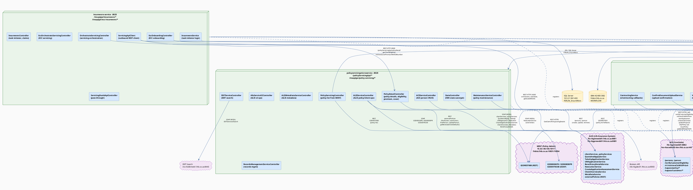

```puml
@startuml insurance-api-microservices  
  
skinparam backgroundColor #FAFAFA  
skinparam defaultFontSize 11  
skinparam componentStyle rectangle  
skinparam ArrowColor #4A6FA5  
skinparam ArrowFontSize 9  
  
skinparam component {  
  BackgroundColor #D6E8FF  
  BorderColor #4A6FA5  
  FontStyle bold  
}  
skinparam node {  
  BackgroundColor #EAF4EA  
  BorderColor #2E7D32  
}  
skinparam database {  
  BackgroundColor #FFF3CD  
  BorderColor #CC8800  
}  
skinparam cloud {  
  BackgroundColor #F3E5F5  
  BorderColor #7B1FA2  
}  
  
title insurance-api-microservices\nService Architecture (lfe-rbmlintap01.fnb.co.za)  
  
' ─────────────────────────────────────────────  
' INFRASTRUCTURE  
' ─────────────────────────────────────────────  
node "Eureka Service Registry\nlfe-rbmlintap01:8882" as EUREKA  
node "Config Server\nfnb-life-config-server" as CONFIG  
  
' ─────────────────────────────────────────────  
' THE 5 MICROSERVICES  
' ─────────────────────────────────────────────  
node "insureworx-service  :8025\n/insapigw/insureworx/*\n/insapigw/ecc-insureworx/*" as IWX_SVC {  
  component "InsureworxController\n(task initiator, claims)" as IWX_CTRL  
  component "OrchestrateServicingController\n(servicing orchestration)" as IWX_ORCH_CTRL  
  component "EccOnboardingController\n(ECC onboarding)" as IWX_ECC_CTRL  
  component "EccOrchestrateServicingController\n(ECC servicing)" as IWX_ECC_ORCH  
  component "ServicingDumbApiController\n(pass-through)" as IWX_DUMB  
  component "ServicingApiClient\n(outbound REST client)" as IWX_CLIENT  
  component "InsureworxService\n(task initiator logic)" as IWX_SVC_LOGIC  
}  
  
node "policyservicingmicroservice  :8020\n/policyServicingApi/*\n/insapigw/policy-servicing/*" as POLICY_SVC {  
  component "PolicyDetailController\n(policy details, eligibility,\npremium, cover)" as POL_DETAIL  
  component "PolicyServicingController\n(policy list from MINT)" as POL_SERV  
  component "ALISServiceController\n(ALIS policy/client ops)" as POL_ALIS  
  component "AlisServiceV2Controller\n(ALIS v2 ops)" as POL_ALIS2  
  component "ALISMetaDataServiceController\n(ALIS metadata)" as POL_META  
  component "ACEServiceController\n(ACE person CRUD)" as POL_ACE  
  component "IDITServiceController\n(IDIT search)" as POL_IDIT  
  component "StateController\n(IWX state save/get)" as POL_STATE  
  component "RecordsManagementServiceController\n(records mgmt)" as POL_REC  
  component "MaintenanceServiceController\n(policy maintenance)" as POL_MAINT  
}  
  
node "communication-service  :8013\n/insapigw/communicationService/*" as COMM_SVC {  
  component "CommunicationController\n(letters, in-app, digital survey,\nSMB email, ALIS send-letter)" as COMM_CTRL  
  component "DigitalSurveyService\n(Adobe survey callbacks)" as COMM_SURVEY  
  component "RestClientService\n(generic outbound REST)" as COMM_REST  
}  
  
node "customer-service  :8014\n/insapigw/customerServiceApi/*\n/insapigw/customer-service/*\n/consent/*" as CUST_SVC {  
  component "CISController\n(CIS lookup, MINT policy list)" as CUST_CIS  
  component "ACEController\n(ACE verify/retrieve)" as CUST_ACE  
  component "LeadsController\n(agent F-number, leads)" as CUST_LEADS  
  component "ImedsController\n(iMeds case create/update)" as CUST_IMEDS  
  component "InAppMessageController\n(in-app messaging)" as CUST_INAPP  
  component "LetterContentsController\n(letter content lookup)" as CUST_LETTER  
  component "ComplianceController\n(PEP compliance)" as CUST_COMP  
  component "TwoFAController\n(2FA)" as CUST_2FA  
  component "AlterationsController\n(policy alterations)" as CUST_ALT  
  component "FuneralReferralController\n(funeral referrals)" as CUST_FUN  
  component "EmployeeInfoController\n(HR employee info)" as CUST_EMP  
  component "CallMigrationController\n(call recording migration)" as CUST_CALL  
  component "ConsentManagementController\n(consent)" as CUST_CONSENT  
  component "NavGarageController\n(NAV garage)" as CUST_NAV  
}  
  
node "document-service  :8016\n/insapigw/documentApi/*\n/insapigw/xtract/customer/*\n/insapigw/document-service/*\n/insapigw/insurance/xtract-callback/*" as DOC_SVC {  
  component "DocumentController\n(upload, confirm, xContract)" as DOC_CTRL  
  component "OCRController\n(OCR extract, callback)" as DOC_OCR  
  component "StaffSchemeController\n(benefit statements)" as DOC_STAFF  
  component "VaultSelfEnablementController\n(vault self-service)" as DOC_VAULT  
  component "ContractingService\n(xContracting callbacks)" as DOC_CONTRACT  
  component "ConfirmDocumentUploadService\n(upload confirmation)" as DOC_UPLOAD  
}  
  
' ─────────────────────────────────────────────  
' EXTERNAL SYSTEMS  
' ─────────────────────────────────────────────  
cloud "InsureWorX / Camunda\nlfe-rbflintap01.fnb.co.za" {  
  component "TaskController  :8085\n(getFirstUWQuestion, saveState,\ngetQuotes, getApplicationID,\ngetXContractReference,\ngetStateIWXInfo, initiateXContract,\neligibilityRules, retrieveNmlResult)" as IWX_TASK  
  component "ServicingController  :8086\n(orchestrateServicing, getTaskCount,\ngetProductInfo, getProductRules,\nmaintainInsuredLives,\nmaintainBeneficiaries,\nsubmitServiceTaskAction,\nretrieveTaskList, maintainContactInfo,\nxContractCallback)" as IWX_SERV_CTRL  
  component "ClaimsController  :8085\n(genericStartTaskSvc)" as IWX_CLAIMS  
  component "OpenMarketController  :8085\n(orchestrateSales)" as IWX_OM  
  component "SalesController  :8085\n(AOP sales process)" as IWX_SALES  
  component "LeadsController  :8085\n(getLeads, updateLeadOutcomes)" as IWX_LEADS  
}  
  
cloud "MINT (Policy Admin)\n10.33.130.165:10111\nfnbtst.fnb.co.za:10031/10054" {  
  component "GSDREST000 (REST)" as MINT_REST  
  component "GSD00026PR / GSD00030PR\nGSDDSYNC00 (SOAP)" as MINT_SOAP  
}  
  
cloud "ALIS (Life Insurance System)\nlfe-rbgintweb01.fnb.co.za:8081\nlfe-rbgpreweb01.fnb.co.za:8081" {  
  component "clientServices, policyServices\nQuoteAndApplyService\nTakeUpApplicationService\nUWApplicationService\nBeneficiaryDetailsService\nNewLetterService\nCreateApplicationAssessmentService\nClientOverviewService\nMetaDataService\nexternalPolicies (REST)" as ALIS_SVC  
}  
  
cloud "ACE (CoreSuite)\nlfe-rbgintweb01:8082\nins-rbacedev02-dev.fnb.co.za:443" {  
  component "/persons, /person\n/verifyCustomerEligibility\n/v1/retrieveCisWithPrism\n/sapace/policy/*\n/sapace/customer/*" as ACE_SVC  
}  
  
cloud "PEP Gateway\npepv3-int.fnb.co.za:8443\npep-int.fnb.co.za:443" {  
  component "CIS LookupCustomerDetails\nMaintainCustomerProfile\nRetrieveCustomerListing\nInquireCUCULink\nFetchEmployeeInformation\nSendMessageToInbox\nCompliance, ControlM\nxContract callback" as PEP_SVC  
}  
  
cloud "IDIT Search\nins-rbidtintwb1.fnb.co.za:8443" as IDIT  
cloud "iMeds\nlfe-rbtstprx:8085" as IMEDS  
cloud "Adobe Digital Survey" as ADOBE  
cloud "Hyphen (Payroll)\nlfe-rbtstrprx.fnb.co.za:8443" as HYPHEN  
cloud "Brokers API\ninb-rbgdev01.fnb.co.za:8083" as BROKERS  
  
' ─────────────────────────────────────────────  
' DATABASES  
' ─────────────────────────────────────────────  
database "SQL Server\n10.5.21.58:1433\nFSRLife_InsureWorx" as DB_IWX  
database "SQL Server\n10.5.21.58:1433\nREDS_HOTSPOTS / FSRLife_InsureWorx\nFSRLife_InsuranceIntuitive\nFSRLife_CallRecordings\nFSRlife_CL_Sales" as DB_CUST  
database "SQL Server\n10.5.21.89\nalisdb (letter contents)" as DB_ALIS  
database "SQL Server\nINS-RBACEDB01\nACEQA_ODP" as DB_ACE  
database "IBM AS/400 DB2\nfnbtst.fnb.co.za\nWORKFLOW" as DB_AS400  
database "SQL Server\n10.5.21.53\nFSRLife_UW_INT (flags)" as DB_FLAGS  
  
' ─────────────────────────────────────────────  
' INFRASTRUCTURE CONNECTIONS  
' ─────────────────────────────────────────────  
IWX_SVC ..> EUREKA : registers  
POLICY_SVC ..> EUREKA : registers  
COMM_SVC ..> EUREKA : registers  
CUST_SVC ..> EUREKA : registers  
DOC_SVC ..> EUREKA : registers  
  
IWX_SVC ..> CONFIG : fetches config  
POLICY_SVC ..> CONFIG : fetches config  
COMM_SVC ..> CONFIG : fetches config  
CUST_SVC ..> CONFIG : fetches config  
DOC_SVC ..> CONFIG : fetches config  
  
' ─────────────────────────────────────────────  
' insureworx-service → InsureWorX/Camunda  
' ─────────────────────────────────────────────  
IWX_CLIENT --> IWX_SERV_CTRL : "REST HTTPS :8086\norchestrate, taskCount,\nproductInfo/Rules,\nmaintainInsuredLives,\nmaintainBeneficiaries,\nsubmitServiceTaskAction,\nretrieveTaskList,\nmaintainContactInfo,\nxContractCallback"  
IWX_SVC_LOGIC --> IWX_CLAIMS : "REST HTTPS :8085\ngenericStartTaskSvc"  
IWX_ORCH_CTRL --> IWX_TASK : "REST HTTPS :8085\norchestrate, saveState,\ngetStateIWXInfo"  
IWX_ECC_CTRL --> IWX_OM : "REST HTTPS :8085\norchestratesSales"  
IWX_ECC_CTRL --> IWX_SALES : "REST HTTPS :8085\nAOP sales"  
IWX_CLIENT --> IWX_LEADS : "REST HTTPS :8085\ngetLeads, updateLeads"  
  
' ─────────────────────────────────────────────  
' insureworx-service → policyservicingmicroservice  
' ─────────────────────────────────────────────  
IWX_CLIENT --> POL_DETAIL : "REST HTTP :8080\n/policyServicingApi/policyDetail/\ngetClientEligibility\nretrieveCoverPremiumWithIdNumber"  
  
' ─────────────────────────────────────────────  
' policyservicingmicroservice → InsureWorX/Camunda  
' ─────────────────────────────────────────────  
POL_STATE --> IWX_TASK : "REST HTTPS :8085\nsaveState, getStateIWXInfo,\ngetFirstUWQuestion, getQuotes,\ngetApplicationID,\ngetXContractReference,\ninitiateXContract,\neligibilityRules"  
  
' ─────────────────────────────────────────────  
' policyservicingmicroservice → External  
' ─────────────────────────────────────────────  
POL_SERV --> MINT_REST : "REST\nGSDREST000\n(policy list)"  
POL_ALIS --> MINT_SOAP : "SOAP\nGSD00026PR, GSD00030PR\nGSDDSYNC00"  
POL_ALIS --> ALIS_SVC : "SOAP (WSDL)\nclientServices, policyServices\nQuoteAndApply, TakeUp\nUWApplication, NewLetter\nCreateApplicationAssessment\nClientOverview, MetaData\nBeneficiaryDetails"  
POL_ALIS --> ALIS_SVC : "REST\nexternalPolicies\n(findCovers, saveCovers,\nfindPerson, updatePerson,\ngetReinstatementDefaults)"  
POL_ACE --> ACE_SVC : "REST\n/persons, /person\n(create, update, retrieve)"  
POL_IDIT --> IDIT : "SOAP (WSDL)\nIDITServices/Search"  
POL_DETAIL --> BROKERS : "REST HTTPS\nGetClaimsPolicyListingDetails"  
POL_MAINT --> PEP_SVC : "REST HTTPS\nControlM reinstate\nxContract callback"  
POL_SERV --> CUST_SVC : "REST HTTP :8080\n/insapigw/customerServiceApi/\ncisService/callCISData\nlookUpCustomer\nlookUpCustomerOcep"  
  
' ─────────────────────────────────────────────  
' customer-service → External  
' ─────────────────────────────────────────────  
CUST_CIS --> MINT_REST : "REST\nGSDREST000\n(policy list fallback)"  
CUST_ACE --> ACE_SVC : "REST HTTPS :443\nverifyCustomerEligibility\nretrieveCisWithPrism\nstartApplication\ncreateLiteContact\nupdateProposal\nodpPolicy ops\nissuePolicy\nupdateBillingDetails"  
CUST_LEADS --> PEP_SVC : "REST HTTPS\ngetAgentFnumber\ngetAgentRef\ncreditValidLead"  
CUST_INAPP --> PEP_SVC : "SOAP HTTPS\nSendMessageToInbox"  
CUST_COMP --> PEP_SVC : "REST HTTPS\nretrieve-compliance\nucnLookUp\nidNumberLookUp"  
CUST_2FA --> PEP_SVC : "SOAP HTTPS\nLookupCustomerDetails\nMaintainCustomerProfile"  
CUST_ALT --> PEP_SVC : "SOAP HTTPS\nRetrieveCustomerListing\nInquireCUCULink"  
CUST_EMP --> PEP_SVC : "SOAP HTTPS\nFetchEmployeeInformation"  
CUST_EMP --> HYPHEN : "REST HTTPS :8443\nemployee-details/v1"  
CUST_IMEDS --> IMEDS : "REST HTTP :8085\ncallImedsCreateService\nupdateImedsService"  
CUST_LETTER --> POLICY_SVC : "REST HTTP :8080\n/policyServicingApi/policyService/\ngetPolicyListFromMINT"  
  
' ─────────────────────────────────────────────  
' communication-service → External  
' ─────────────────────────────────────────────  
COMM_SURVEY --> ADOBE : "REST\n(digital survey data)"  
COMM_CTRL --> ALIS_SVC : "SOAP (WSDL)\nNewLetterService\n(send letter)"  
COMM_CTRL --> PEP_SVC : "SOAP HTTPS\nSendMessageToInbox\n(in-app message)"  
COMM_CTRL --> IWX_SERV_CTRL : "REST HTTPS :8086\nCamunda callbacks\n(digital survey)"  
  
' ─────────────────────────────────────────────  
' document-service → External  
' ─────────────────────────────────────────────  
DOC_OCR --> IWX_SERV_CTRL : "REST HTTPS :8086\nxContractCallback\n(OCR extract callback)"  
DOC_CONTRACT --> IWX_SERV_CTRL : "REST HTTPS :8086\nxContractCallback\n(contracting callback)"  
DOC_UPLOAD --> IWX_SERV_CTRL : "REST HTTPS :8086\nCamunda signal\n(upload confirmation)"  
DOC_CTRL --> PEP_SVC : "REST HTTPS\n/insapigw/documentApi/xContract/"  
  
' ─────────────────────────────────────────────  
' DATABASE CONNECTIONS  
' ─────────────────────────────────────────────  
IWX_SVC --> DB_IWX : "JPA / SQL Server\nFSRLife_InsureWorx"  
IWX_SVC --> DB_AS400 : "JDBC AS/400\nWORKFLOW"  
CUST_SVC --> DB_CUST : "JPA / SQL Server\n(multiple schemas)"  
CUST_SVC --> DB_ALIS : "JPA / SQL Server\nalisdb (letter contents)"  
CUST_SVC --> DB_ACE : "JPA / SQL Server\nACEQA_ODP"  
CUST_SVC --> DB_FLAGS : "JPA / SQL Server\nFSRLife_UW_INT"  
  
@enduml
```
