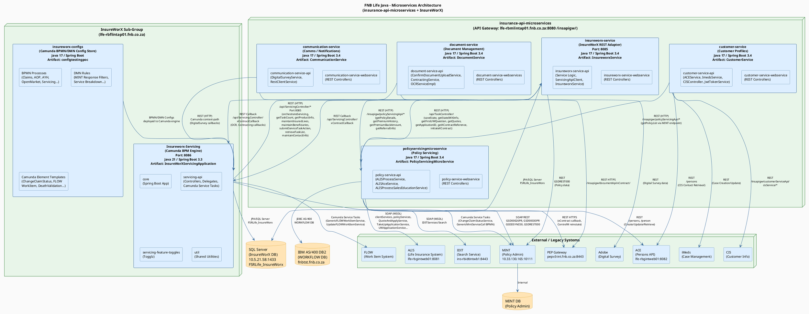

```puml
@startuml FNB Life Java - Service Architecture  
  
!define RECTANGLE class  
  
skinparam componentStyle rectangle  
skinparam backgroundColor #FAFAFA  
skinparam component {  
  BackgroundColor #DDEEFF  
  BorderColor #336699  
  FontSize 12  
}  
skinparam database {  
  BackgroundColor #FFE4B5  
  BorderColor #CC8800  
}  
skinparam node {  
  BackgroundColor #E8F5E9  
  BorderColor #2E7D32  
}  
skinparam arrow {  
  Color #336699  
  FontSize 10  
}  
  
title FNB Life Java - Microservices Architecture\n(insurance-api-microservices + InsureWorX)  
  
' ============================================================  
' EXTERNAL / LEGACY SYSTEMS  
' ============================================================  
node "External / Legacy Systems" {  
  component "MINT\n(Policy Admin)\n10.33.130.165:10111" as MINT  
  component "ALIS\n(Life Insurance System)\nlfe-rbgintweb01:8081" as ALIS  
  component "ACE\n(Persons API)\nlfe-rbgintweb01:8082" as ACE  
  component "IDIT\n(Search Service)\nins-rbidtintwb1:8443" as IDIT  
  component "PEP Gateway\npepv3-int.fnb.co.za:8443" as PEP  
  component "iMeds\n(Case Management)" as IMEDS  
  component "CIS\n(Customer Info)" as CIS  
  component "FLOW\n(Work Item System)" as FLOW  
  component "Adobe\n(Digital Survey)" as ADOBE  
}  
  
' ============================================================  
' INSUREWORX LAYER  (lfe-rbflintap01.fnb.co.za)  
' ============================================================  
node "InsureWorX Sub-Group\n(lfe-rbflintap01.fnb.co.za)" {  
  
  component "**Insureworx-Servicing**\n(Camunda BPM Engine)\nPort: 8086\nJava 21 / Spring Boot 3.3\nArtifact: InsureWorXServicingApplication" as IWX_SERVICING {  
    component "core\n(Spring Boot App)" as IWX_CORE  
    component "servicing-api\n(Controllers, Delegates,\nCamunda Service Tasks)" as IWX_API  
    component "servicing-feature-toggles\n(Togglz)" as IWX_TOGGLES  
    component "util\n(Shared Utilities)" as IWX_UTIL  
  }  
  
  component "**insureworx-configs**\n(Camunda BPMN/DMN Config Store)\nJava 17 / Spring Boot\nArtifact: configtestingpoc" as IWX_CONFIGS {  
    component "BPMN Processes\n(Claims, AOP, AYH,\nOpenMarket, Servicing...)" as BPMN  
    component "DMN Rules\n(MINT Response Filters,\nService Breakdown...)" as DMN  
    component "Camunda Element Templates\n(ChangeClaimStatus, FLOW\nWorkItem, DeathValidation...)" as TEMPLATES  
  }  
}  
  
' ============================================================  
' INSURANCE API MICROSERVICES LAYER  (lfe-rbmlintap01.fnb.co.za:8080)  
' ============================================================  
node "insurance-api-microservices\n(API Gateway: lfe-rbmlintap01.fnb.co.za:8080 /insapigw/)" {  
  
  component "**insureworx-service**\n(InsureWorX REST Adapter)\nPort: 8085\nJava 17 / Spring Boot 3.4\nArtifact: InsureworxService" as IWX_SVC {  
    component "insureworx-service-webservice\n(REST Controllers)" as IWX_WS  
    component "insureworx-service-api\n(Service Logic,\nServicingApiClient,\nInsureworxService)" as IWX_API2  
  }  
  
  component "**policyservicingmicroservice**\n(Policy Servicing)\nJava 17 / Spring Boot 3.4\nArtifact: PolicyServicingMicroService" as POLICY_SVC {  
    component "policy-service-webservice\n(REST Controllers)" as POLICY_WS  
    component "policy-service-api\n(ALISProcessService,\nALISAceService,\nALISProcessSalesEducationService)" as POLICY_API  
  }  
  
  component "**communication-service**\n(Comms / Notifications)\nJava 17 / Spring Boot 3.4\nArtifact: CommunicationService" as COMM_SVC {  
    component "communication-service-webservice\n(REST Controllers)" as COMM_WS  
    component "communication-service-api\n(DigitalSurveyService,\nRestClientService)" as COMM_API  
  }  
  
  component "**customer-service**\n(Customer Profiles)\nJava 17 / Spring Boot 3.4\nArtifact: CustomerService" as CUST_SVC {  
    component "customer-service-webservice\n(REST Controllers)" as CUST_WS  
    component "customer-service-api\n(ACEService, ImedsService,\nCISController, JwtTokenService)" as CUST_API  
  }  
  
  component "**document-service**\n(Document Management)\nJava 17 / Spring Boot 3.4\nArtifact: DocumentService" as DOC_SVC {  
    component "document-service-webservices\n(REST Controllers)" as DOC_WS  
    component "document-service-api\n(ConfirmDocumentUploadService,\nContractingService,\nOCRServiceImpl)" as DOC_API  
  }  
}  
  
' ============================================================  
' DATABASES  
' ============================================================  
database "SQL Server\n(InsureWorX DB)\n10.5.21.58:1433\nFSRLife_InsureWorx" as DB_IWX  
database "IBM AS/400 DB2\n(WORKFLOW DB)\nfnbtst.fnb.co.za" as DB_AS400  
database "MINT DB\n(Policy Admin)" as DB_MINT  
  
' ============================================================  
' RELATIONSHIPS - InsureWorX Servicing → insureworx-service  
' ============================================================  
IWX_SERVICING --> IWX_SVC : "REST (HTTP)\n/api/ServicingController/*\nPort 8085\n(orchestrateServicing,\ngetTaskCount, getProductInfo,\nmaintainInsuredLives,\nmaintainBeneficiaries,\nsubmitServiceTaskAction,\nretrieveTaskList,\nmaintainContactInfo)"  
  
' ============================================================  
' RELATIONSHIPS - insureworx-service → Insureworx-Servicing (callbacks)  
' ============================================================  
IWX_SVC --> IWX_SERVICING : "REST Callback\n/api/ServicingController/\nxContractCallback"  
  
' ============================================================  
' RELATIONSHIPS - insureworx-service → policyservicingmicroservice  
' ============================================================  
IWX_SVC --> POLICY_SVC : "REST (HTTP)\n/insapigw/policyServicingApi/*\n(getPolicyDetails,\ngetPremiumHistory,\ngetPremiumBackAmount,\ngetReferralInfo)"  
  
' ============================================================  
' RELATIONSHIPS - policyservicingmicroservice → insureworx-service (state)  
' ============================================================  
POLICY_SVC --> IWX_SVC : "REST (HTTP)\n/api/TaskController/\n(saveState, getStateIWXInfo,\ngetFirstUWQuestion, getQuotes,\ngetApplicationID, getXContractReference,\ninitiateXContract)"  
  
' ============================================================  
' RELATIONSHIPS - customer-service → policyservicingmicroservice  
' ============================================================  
CUST_SVC --> POLICY_SVC : "REST (HTTP)\n/insapigw/policyServicingApi/*\n(getPolicyList via MINT endpoint)"  
  
' ============================================================  
' RELATIONSHIPS - document-service → Insureworx-Servicing (callbacks)  
' ============================================================  
DOC_SVC --> IWX_SERVICING : "REST Callback\n/api/ServicingController/\nxContractCallback\n(OCR, Contracting callbacks)"  
  
' ============================================================  
' RELATIONSHIPS - communication-service → Camunda  
' ============================================================  
COMM_SVC --> IWX_SERVICING : "REST (HTTP)\nCamunda context-path\n(DigitalSurvey callbacks)"  
  
' ============================================================  
' RELATIONSHIPS - Services → External Systems  
' ============================================================  
IWX_SVC --> MINT : "REST\nGSDREST000\n(Policy data)"  
POLICY_SVC --> MINT : "SOAP/REST\nGSD00026PR, GSD00030PR\nGSDDSYNC00, GSDREST000"  
POLICY_SVC --> ALIS : "SOAP (WSDL)\nclientServices, policyServices,\nQuoteAndApplyService,\nTakeUpApplicationService,\nUWApplicationService..."  
POLICY_SVC --> ACE : "REST\n/persons, /person\n(Create/Update/Retrieve)"  
POLICY_SVC --> IDIT : "SOAP (WSDL)\nIDITServices/Search"  
CUST_SVC --> CIS : "REST\n/insapigw/customerServiceApi/\ncisService/*"  
CUST_SVC --> ACE : "REST\n/persons\n(CIS Contact Retrieval)"  
CUST_SVC --> IMEDS : "REST\n(Case Creation/Update)"  
COMM_SVC --> ADOBE : "REST\n(Digital Survey data)"  
IWX_SERVICING --> FLOW : "Camunda Service Tasks\n(GenericFLOWWorkItemService,\nUpdateFLOWWorkItemService)"  
IWX_SERVICING --> MINT : "Camunda Service Tasks\n(ChangeClaimStatusService,\nGenericMintServiceCall BPMN)"  
IWX_CONFIGS --> IWX_SERVICING : "BPMN/DMN Configs\ndeployed to Camunda engine"  
  
' ============================================================  
' RELATIONSHIPS - Services → PEP Gateway  
' ============================================================  
POLICY_SVC --> PEP : "REST HTTPS\n(xContract callback,\nControlM reinstate)"  
DOC_SVC --> PEP : "REST HTTPS\n/insapigw/documentApi/xContract/"  
  
' ============================================================  
' RELATIONSHIPS - Services → Databases  
' ============================================================  
IWX_SVC --> DB_IWX : "JPA/SQL Server\nFSRLife_InsureWorx"  
POLICY_SVC --> DB_AS400 : "JDBC AS/400\nWORKFLOW DB"  
IWX_SERVICING --> DB_IWX : "JPA/SQL Server\nFSRLife_InsureWorx"  
MINT --> DB_MINT : "Internal"  
  
@enduml
```
