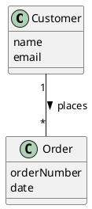
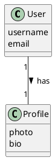
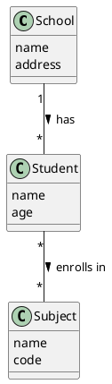

# 🧩 Understanding JSON Schemas Through UML Class Diagrams  
### A guide for business and systems analysts working with APIs

---

## 1. Why This Matters

When you work with APIs, you’re often asked to describe **what data an API sends or receives**.  

This is done using a **JSON Schema**, which defines the *structure* of the data — the “shape” of what the system expects.

But before you can write a JSON schema, you need to understand:
- What *objects* exist in the data  
- What *properties* each object has  
- How those objects *relate* to one another  
- Whether relationships are **one-to-one**, **one-to-many**, or **many-to-many**

UML class diagrams are a perfect tool for this translation — they help you think in **concepts and relationships**, before worrying about JSON syntax.

---

## 2. Step 1 — From Real World Concept to Object

Think of **objects** as *things* in your system.

| Real-world example | System concept | JSON Schema equivalent |
|--------------------:|:---------------|:------------------------|
| A customer | Object (class) | A JSON object (`{ }`) |
| A customer’s name | Attribute (property) | A key-value pair (`"name": "John Smith"`) |
| A customer’s list of orders | Relationship | A JSON array (`"orders": [ ]`) |

🧠 **Tip:** If you can describe something as “a type of thing”, it’s likely an *object*.

---

## 3. Step 2 — Introducing UML Class Diagrams

A **UML Class Diagram** is a visual way to describe the *structure* of objects and their *relationships*.

Each **box** in a class diagram represents an **object (or class)**.  
Each **line** between boxes shows a **relationship** between them.

### 📘 Example



🧭 Read this as:  
> A *Customer* can have **many Orders**, but each *Order* belongs to **one Customer**.

---

## 4. Step 3 — Cardinality (1:1, 1:N, N:M)

Cardinality tells us **how many** of one object relate to another.

| Relationship type | UML notation | Example | JSON representation |
|-------------------:|:--------------:|:---------|:--------------------|
| One-to-One | `1 — 1` | A user has one profile | `"profile": { ... }` |
| One-to-Many | `1 — *` | A customer has many orders | `"orders": [ ... ]` |
| Many-to-Many | `* — *` | A student enrolled in many courses | `"courses": [ ... ]` and `"students": [ ... ]` |

### 📘 Example UML Diagram



---

## 5. Step 4 — Translating UML to JSON Schema

Let’s use our Customer–Order example.

### 🧱 UML Class Diagram


### 🧩 JSON Representation (Example)

```json
{
  "name": "Jane Doe",
  "email": "jane.doe@example.com",
  "orders": [
    {
      "orderNumber": "1234",
      "date": "2025-09-30"
    },
    {
      "orderNumber": "1235",
      "date": "2025-10-01"
    }
  ]
}
```

### 🧬 JSON Schema Equivalent (Simplified)

```yaml
Customer:
  type: object
  properties:
    name:
      type: string
    email:
      type: string
    orders:
      type: array
      items:
        $ref: '#/components/schemas/Order'

Order:
  type: object
  properties:
    orderNumber:
      type: string
    date:
      type: string
      format: date
```

---

## 6. Step 5 — Recognizing Patterns

| Relationship | UML pattern | JSON pattern |
|--------------:|:-------------|:--------------|
| Composition (object contains another) | Box inside a box / `1—1` | Nested JSON object |
| Collection | `1—*` | JSON array |
| Reference | Association line | `$ref` in JSON Schema |

---

## 7. Step 6 — Practical Exercise

🧠 **Exercise:**

Model the following scenario using a UML class diagram, and then translate it into a JSON structure.

> A “School” has many “Students”.  
> Each “Student” belongs to one “School” and can enroll in many “Subjects”.  
> Each “Subject” can have many “Students”.

✅ Deliverables:
- UML Class Diagram showing objects and cardinality  
- Example JSON representation (not full schema yet)

### 📘 UML Example



---

## 8. Step 7 — Bridging UML to OpenAPI

In **OpenAPI**, schemas are used to describe the *data* that flows through API requests and responses.

UML helps you identify what those schemas should be.

| UML Concept | OpenAPI Component |
|--------------|------------------|
| Class | Schema (`components/schemas`) |
| Attribute | Property (`properties`) |
| Association | Nested schema or `$ref` |
| Multiplicity | Array (`type: array`) |

---

## 9. Summary — Mental Model for Analysts

| Concept | Think of it as | In JSON |
|----------|----------------|---------|
| Object | A *thing* with attributes | `{ ... }` |
| Property | A detail about that thing | `"name": "Chris"` |
| Relationship | A connection between things | Nested object or array |
| Multiplicity | “How many?” | Single vs list `[ ... ]` |
| Schema | The *template* | A blueprint of what data looks like |

---

## 10. Key Takeaways

✅ Use **UML class diagrams** to clarify relationships before touching JSON  
✅ Think in **objects and their properties** — not code  
✅ Understand **cardinality** — it defines your array or object structure  
✅ Use **real-world analogies** (people, orders, schools) to explain data  
✅ Once the UML makes sense, JSON Schema and OpenAPI specs will follow naturally  

---
